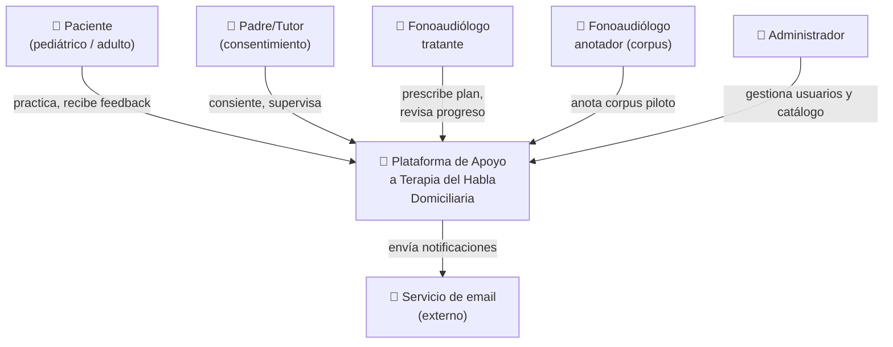
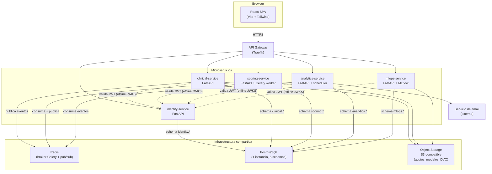
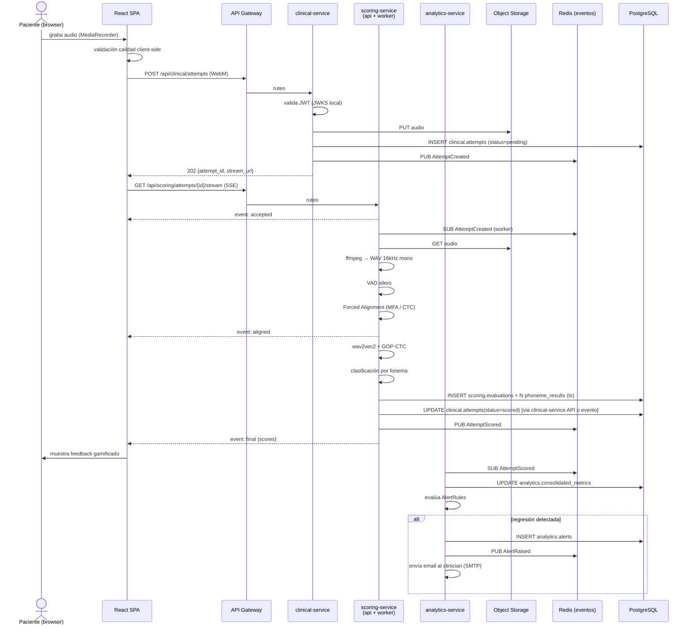
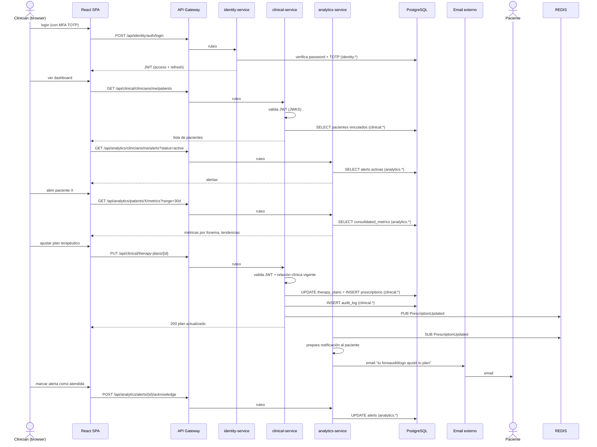
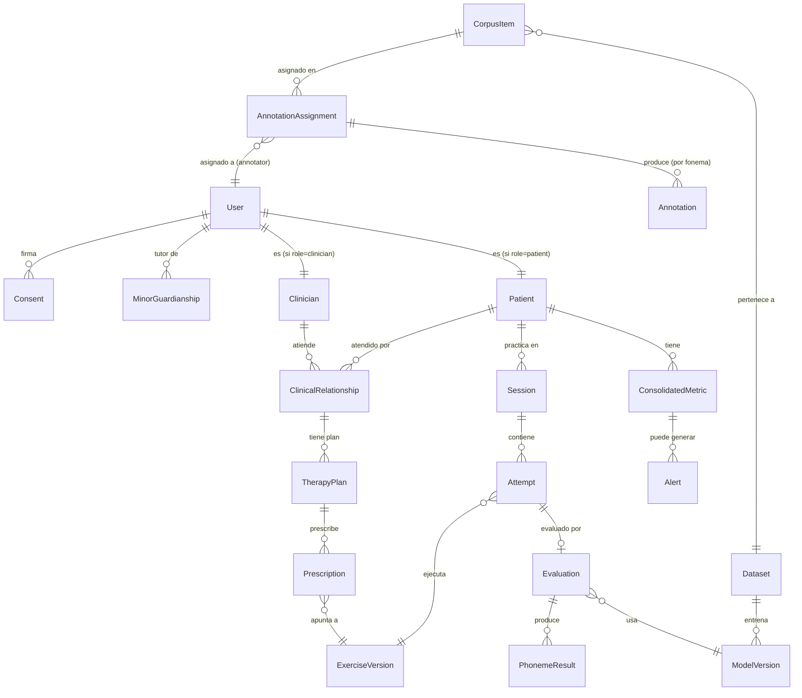
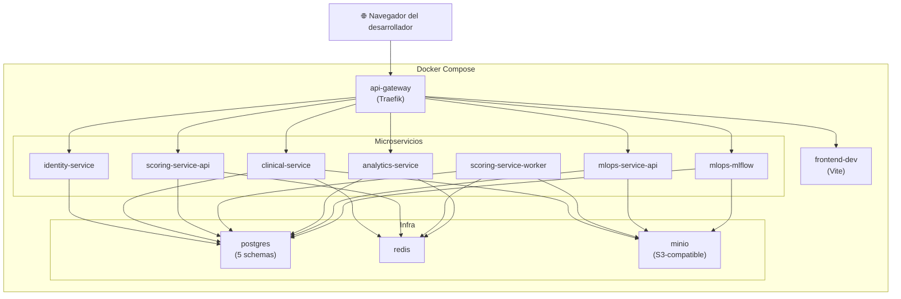
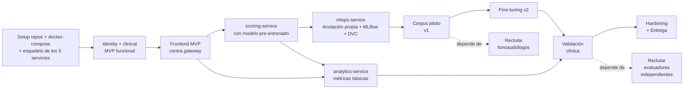

# Arquitectura Lógica — Plataforma de Apoyo a Terapia del Habla Domiciliaria

**Proyecto Final de Ingeniería en Informática — UADE**
**Autores:** Leiva, Lucas Ezequiel · Peletay, Facundo Ezequiel
**Tutor:** Farías, Pablo Lionel
**Versión:** 2.1 — Julio 2026 *(reingeniería del subsistema de anotación: módulo propio integrado en la plataforma, se descarta Label Studio)*

---

## Resumen ejecutivo

La plataforma resuelve un problema concreto: los fonoaudiólogos pierden visibilidad sobre la práctica domiciliaria de sus pacientes y no pueden ajustar oportunamente el plan terapéutico. La solución es una aplicación web que captura audio en el navegador del paciente, lo evalúa fonema a fonema mediante Forced Alignment y Goodness of Pronunciation (GOP), devuelve feedback motivacional inmediato y consolida un tablero clínico para el profesional. El alcance fonémico abarca /p/, /t/, /k/, /m/, /n/, /l/, /s/, /r/, /rr/, /ch/, /tr/ en español rioplatense, con foco inicial en población pediátrica con TSH y adultos en rehabilitación post-neurológica.

La arquitectura propuesta es un **sistema de microservicios en Python**, agrupados según criterios de transaccionalidad, perfil técnico y dominio de negocio. Son cinco servicios: `identity-service`, `clinical-service`, `scoring-service`, `analytics-service` y `mlops-service`. El frontend es React + Vite + Tailwind y consume cada servicio vía HTTP/REST a través de un API Gateway. Los servicios se comunican entre sí mediante HTTP/REST sincrónico cuando necesitan respuesta inmediata, y mediante eventos asincrónicos sobre Redis pub/sub para los flujos que naturalmente lo son (procesamiento de intentos, consolidación de métricas, disparo de alertas). La persistencia es PostgreSQL única físicamente, con **un schema dedicado por servicio** (`identity.*`, `clinical.*`, `scoring.*`, `analytics.*`, `mlops.*`) y prohibición de foreign keys cross-schema: cada servicio es dueño exclusivo de su schema. El almacenamiento de audio y artefactos ML se hace en object storage compatible S3 (MinIO en local). Forced Alignment con **Montreal Forced Aligner 3.x** y scoring con **GOP-CTC alignment-free** sobre wav2vec2-XLSR-53 fine-tuneado, ambos contenidos dentro de `scoring-service`. El subsistema de MLOps se construye con un **módulo de anotación propio integrado en la plataforma + DVC + MLflow** self-hosted, todo dentro de `mlops-service`: la validación de los profesionales y la carga de audios al corpus ocurren dentro de la misma aplicación, sin herramientas externas ni cambio de contexto. Todos los audios (intentos de pacientes y corpus) se almacenan en el object storage propio del sistema.

El despliegue de infraestructura productiva queda fuera del alcance de este documento. Todo el sistema se desarrolla y prueba sobre **Docker Compose local**, con un servicio adicional `api-gateway` (Traefik o Nginx) que enruta hacia cada microservicio. La decisión de plataforma de hosting se difiere al cierre del proyecto.

---

## Tabla de decisiones arquitectónicas clave

| # | Decisión | Opciones consideradas | Opción elegida | Justificación |
|---|----------|------------------------|----------------|---------------|
| 1 | Estilo arquitectónico | Monolito clásico, monolito modular, microservicios | **Microservicios (5 servicios)** | Cada bounded context tiene perfiles de carga, ciclo de vida y dependencias técnicas distintas. El subsistema de scoring (ML pesado, 2GB RAM, ciclo MLOps propio) se beneficia de estar aislado del CRUD clínico transaccional. El subsistema de MLOps (anotación, MLflow) tiene su propio dominio de usuarios (anotadores, no pacientes). La separación se justifica por límites de transaccionalidad, perfil técnico y dominio. |
| 2 | Granularidad de los microservicios | 1 servicio por bounded context (8), agrupados (5), agrupados (3) | **5 servicios agrupados por límite** | Se agrupan bounded contexts que comparten transacciones (Clinical + Exercise Catalog + Practice viven juntos porque prescribir y practicar tocan las tres entidades en una sola transacción). Se separan los que tienen perfiles técnicos opuestos (scoring ML vs CRUD). Granularidad demasiado fina (8 servicios) sumaría overhead de coordinación sin beneficio. |
| 3 | Framework web Python | FastAPI, Django, Flask | **FastAPI en todos los servicios** | Async nativo, Pydantic para contratos entre servicios, tipado fuerte, OpenAPI automático (clave para que cada servicio publique su contrato). Stack uniforme entre microservicios reduce la carga cognitiva de cambiar de uno a otro. |
| 4 | Doble runtime Python+Java vs unificado | Python+Java (Kaldi nativo + servicio Spring), solo Python | **Solo Python** | MFA 3.x corre desde Python (Kalpy bindings). gop-pykaldi, torch, transformers, librosa, todo Python. Sumar JVM duplicaría toolchain en cada microservicio sin beneficio. |
| 5 | Motor de base de datos | PostgreSQL solo, PostgreSQL+MongoDB, una DB por servicio | **PostgreSQL única con un schema por microservicio** | Postgres soporta JSONB nativo para resultados fonémicos heterogéneos. DB-per-service ortodoxo implicaría 5 instancias Postgres (5 backups, 5 sets de migraciones), costo operativo no justificado para esta escala. Schema-per-service mantiene aislamiento lógico fuerte (cada servicio es dueño exclusivo de su schema, sin foreign keys cross-schema) preservando la opción de separar físicamente en el futuro. |
| 6 | Broker de eventos asincrónicos | Redis pub/sub, RabbitMQ, Kafka, NATS | **Redis pub/sub (mismo Redis que cola de tareas)** | Volumen de eventos esperado bajo (decenas por segundo en producción inicial). Redis ya está en el stack como broker Celery. Kafka/RabbitMQ son sobreingeniería a esta escala. Si el volumen crece, migración a NATS o Kafka es localizada al `event-bus` interno. |
| 7 | Comunicación sincrónica entre servicios | HTTP/REST + JSON, gRPC, GraphQL Federation | **HTTP/REST + JSON con contratos Pydantic** | gRPC suma compilación de protobuf y reduce debuggabilidad sin ganancia clara a esta escala. GraphQL Federation es para casos con N consumidores y M servicios, no para 5 servicios y 1 frontend. HTTP/REST con Pydantic da contratos suficientemente fuertes y OpenAPI gratis. |
| 8 | API Gateway | Traefik, Nginx, Kong, custom FastAPI | **Traefik** | Configuración declarativa, integración nativa con Docker (descubre servicios por labels), gestión de TLS, métricas Prometheus. Kong es overkill. Custom FastAPI duplicaría auth/ruteo. |
| 9 | Almacenamiento de audio y artefactos | Filesystem local, object storage compatible S3 | **Object storage compatible S3 (MinIO en local)** | API S3 es estándar de facto. MinIO en local replica la API exactamente; cualquier proveedor S3-compatible funciona en producción sin cambios. Audio inmutable, URLs pre-firmadas para acceso temporal del frontend. |
| 10 | Motor de Forced Alignment | MFA 3.x, whisper-timestamped, wav2vec2-CTC + Viterbi, charsiu | **MFA 3.x (modelo `spanish_mfa` v3) como baseline + alineación CTC con wav2vec2 como camino evolutivo** | MFA está en producción, tiene modelo español pre-entrenado y diccionario, es robusto. La línea de investigación 2024–2026 (NOCASA 2025, Cao et al.) muestra que GOP-CTC alignment-free supera al GOP clásico en habla infantil. Plan: MFA como alineador de referencia para construir el corpus anotado; en el pipeline de inferencia, alineación CTC sin segmentación previa. |
| 11 | Modelo de scoring GOP | gop-pykaldi (Witt&Young clásico), wav2vec2 + GOP-DNN, GOP-CTC alignment-free | **GOP-CTC alignment-free sobre wav2vec2-XLSR-53 fine-tuneado** | El estado del arte 2024–2026 muestra que GOP-CTC supera al GOP clásico en habla infantil y reduce errores de alineación que afectan a GOP en TSH. gop-pykaldi (UBA-CONICET) se mantiene como referencia conceptual y para validación cruzada inicial. |
| 12 | Modelo base ASR | facebook/wav2vec2-xls-r-300m, jonatasgrosman/wav2vec2-large-xlsr-53-spanish, NeMo Citrinet | **`jonatasgrosman/wav2vec2-large-xlsr-53-spanish` como punto de partida + fine-tuning** | Pre-entrenado en español, licencia abierta, ~1.2GB. Inferencia en CPU viable (~1–2s para audio de 3s). Plan B: NeMo Citrinet-256 quantizado a INT4 (17MB, <300ms) si la latencia se vuelve crítica. |
| 13 | Herramienta de anotación | Label Studio self-hosted, Praat + scripts, ELAN, módulo propio React | **Módulo de anotación propio integrado en la plataforma (UI en la SPA + API en `mlops-service`)** | La tarea de anotación de FONIA quedó cerrada y acotada: por fonema objetivo, escala ordinal de tres opciones (correcto / aproximación / incorrecto) + dropdown de `produced_phoneme`. No requiere transcripción libre ni segmentación manual, por lo que no necesita un anotador genérico. Label Studio implicaba un contenedor externo, integración iframe + SSO, modelo de usuarios duplicado y mantenimiento de plantillas XML. El módulo propio reutiliza identidad (rol `annotator`, JWT/RBAC), el design system del frontend y las URLs pre-firmadas de object storage: los profesionales validan sin salir de la aplicación. Praat/ELAN siguen descartados por ser desktop. |
| 14 | Versionado de datasets | DVC con remote object storage, Git LFS, manual | **DVC con remote en S3-compatible** | Versionado declarativo, integra con MLflow, S3 como backend es trivial. Git LFS tiene cuota baja y no es para datasets de audio. |
| 15 | Versionado/registry de modelos | MLflow self-hosted, W&B, registry comercial | **MLflow self-hosted dentro de `mlops-service`** | Open source, métricas + artefactos + lineage. MLflow Tracking server con backend Postgres (schema `mlops.*` de la misma DB) + object storage para artefactos. |
| 16 | Autenticación | OAuth proveedor externo, Keycloak, FastAPI Users propio | **`identity-service` propio con FastAPI Users + JWT, RBAC** | Mantiene portabilidad y no agrega un sexto proceso externo. JWT firmados por `identity-service` son verificables offline por los demás servicios usando la clave pública (JWKS), evitando un cuello de botella sincrónico en cada request. MFA opcional vía TOTP. |
| 17 | Comunicación frontend ↔ feedback de scoring | Polling, WebSocket, SSE | **Server-Sent Events (SSE) por intento, expuesto por `scoring-service` vía gateway** | El flujo es 1:1 (paciente envía intento → recibe resultado). WebSocket es bidireccional y costoso. SSE sobre HTTPS es nativo en navegadores modernos y permite enviar resultados parciales (alineación lista → 1s; GOP por fonema → 3–5s). |
| 18 | IaC y entornos | Docker Compose, Terraform, Kubernetes local | **Docker Compose para todo el desarrollo y validación** | Mantiene reproducibilidad sin atarse a proveedor. `docker-compose up` levanta los 5 servicios + Postgres + Redis + MinIO + API Gateway. Despliegue productivo se difiere. |

---

## 1. Visión general de la arquitectura

### 1.1 Estilo arquitectónico: microservicios agrupados por límite

El sistema se descompone en cinco microservicios. La agrupación no responde a "un servicio por bounded context" sino a tres criterios combinados:

- **Transaccionalidad**: entidades que cambian juntas en una sola transacción permanecen en el mismo servicio. Prescribir un plan toca `TherapyPlan`, `Prescription` y `ExerciseVersion` en una sola operación atómica — los tres viven en `clinical-service`. Procesar un intento crea `Evaluation` y N `PhonemeResult` atómicamente — viven en `scoring-service`.
- **Perfil técnico y ciclo de vida**: componentes con dependencias pesadas (wav2vec2 cargado en memoria, MFA + Kaldi, PyTorch) o con su propio ciclo de vida MLOps se aíslan. El scoring no debe arrastrar al CRUD clínico al actualizar un modelo, y viceversa.
- **Dominio de negocio y actores**: cuando los usuarios y casos de uso son conceptualmente distintos (anotadores de corpus vs. fonoaudiólogos tratantes, vs. pacientes), la separación es natural.

Los cinco servicios resultantes:

| Servicio | Bounded contexts que contiene | Por qué juntos |
|---|---|---|
| **`identity-service`** | Identity (usuarios, roles, consentimientos, MFA, JWT) | Transversal. Aislado por seguridad. Su API es consumida por los demás servicios al validar tokens, pero la validación es offline (vía JWKS), por lo que no se convierte en cuello de botella. |
| **`clinical-service`** | Clinical + Exercise Catalog + Practice | Transaccionalmente acoplados. Prescribir un plan toca las tres áreas; recibir un intento crea `Session` + `Attempt` referenciando al plan y al ejercicio. Perfil de carga liviano, todo CRUD. |
| **`scoring-service`** | Scoring (pipeline ML completo: conversión, VAD, alignment, GOP, clasificación) | Perfil técnico radicalmente distinto del resto: 2GB RAM por instancia con wav2vec2 cargado, dependencias de PyTorch, MFA, ffmpeg. Ciclo de vida atado al modelo (versionado, rollback). Aloja el worker de procesamiento. |
| **`analytics-service`** | Analytics + Notifications | Consume eventos del resto y produce métricas consolidadas, alertas, notificaciones. No requiere transaccionalidad con clinical. Puede correr más lento sin afectar la experiencia del paciente. |
| **`mlops-service`** | Corpus + Anotación (módulo propio) + Registry (MLflow) + DVC | Mundo aparte: usado por anotadores y desarrolladores, no por pacientes ni clínicos en producción. Expone la API de anotación propia (cuya UI vive en la misma SPA de la plataforma) y empaqueta MLflow. Los anotadores usan la misma identidad y la misma aplicación que el resto de los usuarios. |

### 1.2 Diagrama de contexto C4 — Nivel 1



### 1.3 Diagrama de contenedores C4 — Nivel 2



### 1.4 Decisiones transversales

- **Configuración por servicio**: Pydantic Settings + variables de entorno por contenedor. Cada servicio tiene su propio `.env`.
- **Comunicación inter-servicios**:
    - **HTTP/REST sincrónico** para llamadas que requieren respuesta inmediata (consultar perfil de usuario, validar relación clínica vigente).
    - **Eventos async sobre Redis pub/sub** para flujos naturalmente asincrónicos (`AttemptCreated`, `AttemptScored`, `MetricUpdated`, `AlertRaised`).
    - **Validación de JWT offline** vía JWKS publicado por `identity-service`. Cada servicio descarga la clave pública al startup y valida tokens localmente. Esto evita un round-trip por request.
- **Logging**: structlog → stdout. Cada servicio identifica sus logs con su nombre. En agregación, se pueden correlacionar por `trace_id` que viaja en headers HTTP y en eventos.
- **Tracing**: OpenTelemetry con trace_id propagado entre servicios y a través de eventos. Fase opcional, recomendada desde el inicio porque debuggear distribuido sin tracing es caro.

---

## 2. Capa de presentación (Frontend React)

### 2.1 Módulos del frontend

| Módulo | Usuario | Responsabilidad | Servicios que consume |
|--------|---------|-----------------|------------------------|
| **Portal de paciente** | Paciente / Tutor | Login, agenda de práctica diaria, listado de ejercicios prescritos | identity, clinical |
| **Módulo de captura de audio** | Paciente | Grabación, validación de calidad, envío, recepción de feedback en vivo | clinical (POST intento), scoring (SSE) |
| **Panel de progreso (paciente)** | Paciente / Tutor | Gamificación, badges, tendencia personal por fonema | analytics |
| **Portal del profesional** | Fonoaudiólogo | Pacientes a cargo, dashboards individuales, prescripción de planes | identity, clinical, analytics |
| **Dashboard clínico** | Fonoaudiólogo | Tendencias, alertas tempranas, comparación inter-paciente | analytics |
| **Módulo de anotación** | Fonoaudiólogo colaborador | Cola de ítems asignados, reproductor de audio (URLs pre-firmadas), evaluación fonema a fonema con escala ordinal (correcto / aproximación / incorrecto) + dropdown de fonema producido, carga de audios al corpus (captura supervisada o upload). **Decisión: módulo React propio dentro de la SPA**, consume la API de anotación de `mlops-service`. Sin herramientas externas. | mlops (API propia) |
| **Admin** | Administrador | Catálogo de ejercicios, gestión de usuarios, consentimientos | identity, clinical |

Toda la comunicación con el backend pasa por el **API Gateway** en una URL única. El frontend no conoce la topología interna de microservicios. Las rutas se organizan por prefijo (`/api/identity/`, `/api/clinical/`, `/api/scoring/`, `/api/analytics/`, `/api/mlops/`) que el gateway enruta al servicio correspondiente.

### 2.2 Captura de audio en navegador

- **API**: MediaRecorder API. Fallback a `getUserMedia` raw + AudioWorklet si MediaRecorder falla.
- **Formato de captura**: WebM/Opus (nativo en Chrome/Firefox/Edge) — comprimido, ~24 kbps mono, 16 kHz.
- **Conversión server-side**: el `scoring-service` convierte WebM/Opus → WAV mono 16 kHz 16-bit con `ffmpeg` antes del pipeline ML. **No** se hace conversión client-side (carga al móvil pediátrico).
- **Sample rate**: 16 kHz mono. Estándar para ASR y wav2vec2.
- **Permisos**: prompt explícito de micrófono al primer uso, mensaje accesible para niños y adultos mayores. Detección de permiso denegado con guía visual de cómo habilitarlo.
- **Fallback navegadores no soportados** (Safari iOS <14, navegadores in-app de redes): mensaje claro + sugerencia de navegador. [supuesto: la población objetivo accede mayoritariamente desde Chrome Android/Desktop o Safari iOS reciente]
- **Validación de calidad client-side antes del envío**: VAD ligero (`@ricky0123/vad-web`), nivel RMS mínimo, duración mínima/máxima por ejercicio. Si falla, se invita a repetir sin gastar cuota del backend.

### 2.3 Estado, ruteo, autenticación

- **Manejo de estado**: **Zustand** (no Redux). Zustand es 1.5KB, sin boilerplate, suficiente para la complejidad esperada. Context API queda para el `AuthProvider`.
- **Server state**: **TanStack Query (React Query)** para cache de datos del backend, invalidación, retry. Una key por servicio + recurso facilita invalidaciones quirúrgicas.
- **Ruteo**: **React Router 7** con `loader` por ruta.
- **Auth en el cliente**: JWT en `httpOnly cookie` + refresh token rotativo emitido por `identity-service`. Nunca tocamos `localStorage` para tokens (XSS). El gateway propaga la cookie a todos los servicios.

### 2.4 Feedback en tiempo real al paciente

**Decisión: SSE (Server-Sent Events)** sobre WebSocket.

Razones:
- El feedback es **unidireccional** (server → cliente) por intento. No hay chat.
- SSE viaja sobre HTTP/HTTPS estándar, atraviesa proxies y gateway sin configuración especial. WebSocket requiere upgrades y manejo de timeouts que complican el deploy.
- Reconexión nativa del navegador.
- Latencia objetivo end-to-end: **<5s desde envío del intento hasta primera respuesta del backend**. SSE permite enviar resultados parciales (alineación lista → 1s; GOP por fonema → 3–5s) en lugar de un único response monolítico.

Patrón concreto:
1. Cliente hace `POST /api/clinical/attempts` con el audio (multipart) → `clinical-service` registra el `Attempt`, sube el audio a object storage y publica el evento `AttemptCreated` en Redis. Devuelve `{attempt_id, stream_url}`.
2. `stream_url` apunta a `/api/scoring/attempts/{id}/stream` — `scoring-service` mantiene el stream SSE abierto.
3. Cliente abre `EventSource(stream_url)` → recibe eventos `aligned`, `scored_phoneme`, `final`.
4. Cliente cierra el stream tras `final`.

### 2.5 Responsive y accesibilidad

- **Mobile-first**. La mayoría de pacientes usa el teléfono familiar.
- **Tamaños mínimos de tap target**: 44×44 px (WCAG 2.1 AA).
- **Modo gamificado** para pediátricos: iconografía generosa, animaciones lúdicas, voz de instrucciones grabada por humanos (no TTS).
- **Modo simple** para adultos mayores: tipografía grande, contraste alto, menos animaciones.
- **Contraste y daltonismo**: paleta validada con simulador (deuteranopía, protanopía).
- **Lector de pantalla**: todos los controles tienen `aria-label`. Los resultados fonémicos se anuncian.
- **Sin dependencia de audio para feedback**: los resultados también se muestran visualmente.

---

## 3. Capa de servicios de aplicación (cinco microservicios Python)

Todos los servicios comparten el mismo stack base: FastAPI + Uvicorn + Pydantic + SQLAlchemy + Alembic. Cada uno vive en su propio repositorio o subdirectorio del monorepo, con su propio `Dockerfile`, su propio `pyproject.toml` y su propio set de migraciones que tocan **únicamente su schema**.

### 3.1 `identity-service`

**Responsabilidad**: ser la fuente única de verdad de identidad y consentimientos. Emite los JWT que el resto del sistema valida offline.

**Schema Postgres**: `identity.*`

**Modelos principales**:
- `User(id, email, password_hash, role, created_at, mfa_secret)`
- `Role` y permisos asociados.
- `Consent(id, user_id, type, signed_at, revoked_at, content_version)` — tres tipos: uso de plataforma, tratamiento clínico, cesión al corpus.
- `MinorGuardianship(minor_user_id, guardian_user_id, signed_at)`.
- `RefreshToken(id, user_id, token_hash, expires_at, revoked_at)`.

**Endpoints clave**:
- `POST /auth/register`, `POST /auth/login`, `POST /auth/refresh`, `POST /auth/logout`.
- `GET /.well-known/jwks.json` — clave pública para verificación offline en otros servicios.
- `GET /users/me`, `PATCH /users/me`.
- `POST /consents`, `DELETE /consents/{id}` (revocación).
- `POST /mfa/setup`, `POST /mfa/verify`.

**Tokens**: JWT firmados con RS256 (clave privada solo en `identity-service`, pública distribuida vía JWKS). Acceso 15 min, refresh 7 días rotativo.

**Roles**: `patient`, `guardian`, `clinician`, `annotator`, `admin`.

**Reglas críticas**:
- Menores: registro requiere `MinorGuardianship` activo. Sin ese registro, los flujos clínicos quedan bloqueados.
- MFA TOTP obligatorio para `clinician` y `admin`, opcional para el resto.

### 3.2 `clinical-service`

**Responsabilidad**: dominio clínico transaccional. Maneja pacientes, fonoaudiólogos, relaciones clínicas, planes terapéuticos, prescripciones, catálogo de ejercicios, sesiones de práctica e intentos.

**Schema Postgres**: `clinical.*`

**Modelos principales**:
- `Patient(user_id, birth_date, sex, diagnosis_category, pseudonym_id)` — `user_id` referencia lógica a `identity.users` (no hay FK física).
- `Clinician(user_id, license_number, specialty)`.
- `ClinicalRelationship(id, clinician_id, patient_id, started_at, ended_at)`.
- `TherapyPlan(id, patient_id, clinician_id, start_date, end_date, status)`.
- `Prescription(id, plan_id, exercise_version_id, frequency_per_week, target_attempts)`.
- `Exercise(id, name, phoneme, level)`.
- `ExerciseVersion(id, exercise_id, version, prompt_text, reference_audio_key, published_at)`.
- `Session(id, patient_id, started_at, ended_at)`.
- `Attempt(id, session_id, exercise_version_id, audio_key, status, submitted_at)`.

**Reglas críticas**:
- Un paciente solo puede tener planes activos creados por un clinician con `ClinicalRelationship` vigente.
- Editar un `Exercise` crea una `ExerciseVersion` nueva; los `Attempt` viejos siguen apuntando a la versión con la que se ejecutaron (auditoría).
- `Attempt.status` es máquina de estados: `pending` → `processing` → `scored` | `failed` | `rejected_quality`. `clinical-service` solo escribe `pending`; las transiciones posteriores las hace `scoring-service` vía evento.

**Eventos que publica**:
- `AttemptCreated{attempt_id, audio_key, exercise_version_id, patient_id, expected_phonemes[]}` — consumido por `scoring-service`.
- `PrescriptionUpdated{plan_id, patient_id, clinician_id, changes}` — consumido por `analytics-service` (para recalcular adherencia) y `identity-service` (para auditoría).

**Endpoints clave** (entre muchos otros):
- `POST /patients`, `GET /patients/{id}`, `GET /clinicians/me/patients`.
- `POST /therapy-plans`, `PUT /therapy-plans/{id}`.
- `GET /exercises`, `POST /admin/exercises`.
- `POST /sessions`, `POST /attempts` (multipart con audio).

### 3.3 `scoring-service`

**Responsabilidad**: convertir un intento de audio en una evaluación fonémica. Es el corazón ML del sistema.

**Schema Postgres**: `scoring.*`

**Modelos principales**:
- `Evaluation(id, attempt_id, model_version_id, global_gop, classification, scored_at)` — `attempt_id` referencia lógica a `clinical.attempts`.
- `PhonemeResult(id, evaluation_id, phoneme_expected, start_ms, end_ms, gop_score, classification, confidence)`.
- `FailedJob(id, attempt_id, error_class, traceback, payload, failed_at)` — dead-letter.

**Composición interna**: `scoring-service` es a su vez dos procesos dentro del mismo paquete:
- **`scoring-api`** (FastAPI): expone el endpoint SSE `/attempts/{id}/stream`, recibe consultas sobre evaluaciones pasadas, sirve el endpoint OpenAPI.
- **`scoring-worker`** (Celery): consume eventos `AttemptCreated` desde Redis, ejecuta el pipeline ML completo, persiste `Evaluation` + `PhonemeResult`, publica `AttemptScored`.

Esto es el equivalente al patrón `api + worker` clásico, pero ahora aislado dentro de un microservicio con dominio propio. Comparten codebase y schema Postgres.

**Eventos que consume**:
- `AttemptCreated` (de `clinical-service`).

**Eventos que publica**:
- `AttemptScored{attempt_id, evaluation_id, global_gop, classification, phoneme_results[], model_version_id}` — consumido por `analytics-service`.
- `AttemptFailed{attempt_id, reason}` — consumido por `analytics-service` y `clinical-service`.

**Dependencias técnicas** (justifican el aislamiento):
- PyTorch + transformers (~3 GB de wheels).
- wav2vec2-XLSR-53 español cargado en RAM (~1.2 GB, persistente entre tareas).
- MFA 3.x + binarios Kaldi compilados.
- ffmpeg, librosa, silero-vad.

**Decisión clave**: los modelos se cargan **al startup del worker** y permanecen en memoria. No se recargan por tarea. Esto descarta runtimes serverless en este servicio.

### 3.4 `analytics-service`

**Responsabilidad**: consolidar las evaluaciones individuales en métricas longitudinales por paciente, detectar tendencias (mejora / estancamiento / regresión), disparar alertas tempranas al fonoaudiólogo y enviar notificaciones.

**Schema Postgres**: `analytics.*`

**Modelos principales**:
- `ConsolidatedMetric(id, patient_id, period_start, period_end, phoneme, success_rate, trend_slope, attempts_count, payload_jsonb)`.
- `Alert(id, patient_id, clinician_id, kind, severity, payload_jsonb, created_at, acknowledged_at)`.
- `AlertRule(id, scope, kind, threshold, window_days, active)` — configurables por admin o por clinician.
- `Notification(id, user_id, channel, payload_jsonb, sent_at, read_at)`.

**Eventos que consume**:
- `AttemptScored` (de `scoring-service`) — actualiza métricas del paciente.
- `AttemptFailed` (de `scoring-service`) — registra en métrica de calidad de captura.
- `PrescriptionUpdated` (de `clinical-service`) — recalcula adherencia esperada.

**Eventos que publica**:
- `AlertRaised{alert_id, patient_id, clinician_id, kind, severity}` — consumido internamente para enviar notificaciones, y publicado para auditoría.

**Endpoints clave**:
- `GET /patients/{id}/metrics?range=30d&phoneme=r`.
- `GET /clinicians/me/alerts?status=active`.
- `POST /alerts/{id}/acknowledge`.

**Procesos internos**:
- **Listener de eventos**: consumidor pub/sub que actualiza `ConsolidatedMetric` y evalúa reglas de alerta.
- **Scheduler** (APScheduler o similar): jobs periódicos para métricas que no son event-driven (adherencia semanal, recordatorios).
- **Notificador**: envía emails via servicio SMTP/SES externo.

### 3.5 `mlops-service`

**Responsabilidad**: subsistema de gestión de corpus, anotación, datasets y registry de modelos. Es el "mundo aparte" del proyecto, usado por anotadores y desarrolladores.

**Schema Postgres**: `mlops.*`

**Componentes**:
- **Módulo de anotación** (parte del FastAPI propio): gestión de asignaciones multi-anotador, registro de juicios fonema a fonema de los profesionales, alta de audios al corpus (upload directo o captura supervisada desde la plataforma), resolución de URLs pre-firmadas para reproducción. **La UI vive en la SPA de la plataforma**: el anotador nunca sale de la aplicación.
- **MLflow Tracking Server**: registry de modelos y experimentos. Backend en `mlops.mlflow_*`, artefactos en object storage. Herramienta interna de desarrolladores, no de profesionales.
- **API de orquestación** (mismo proceso FastAPI): endpoints de gestión de datasets, integración con DVC, control de promoción de modelos.

**Modelos propios (además de los internos de MLflow)**:
- `CorpusItem(id, audio_key, pseudonym_id, age_range, sex, diagnosis, target_phoneme, source, dvc_hash)`.
- `AnnotationAssignment(id, corpus_item_id, annotator_user_id, status, assigned_at, completed_at)` — `status` ∈ `pending` | `in_progress` | `completed`. `annotator_user_id` es referencia lógica a `identity.users.id`. El solapamiento para IRR se logra asignando el mismo ítem a 2+ anotadores.
- `Annotation(id, assignment_id, phoneme_index, phoneme_expected, label, produced_phoneme, comment, created_at)` — un registro por fonema objetivo. `label` ∈ `correcto` | `aproximacion` | `incorrecto`. `produced_phoneme` se completa solo cuando `label` ≠ `correcto`.
- `Dataset(id, name, version, dvc_hash, created_at, item_count, train_split_hash, val_split_hash, test_split_hash)`.
- `ModelVersion(id, mlflow_run_id, dataset_id, model_type, metrics_jsonb, status, promoted_at)` — `status` ∈ `staging` | `production` | `archived`.

**Endpoints clave**:
- `POST /corpus/items` — alta de un ítem del corpus con su audio (multipart) desde la propia plataforma.
- `GET /corpus/items?phoneme=r&diagnosis=tsh`.
- `GET /corpus/items/{id}/audio-url` — URL pre-firmada de object storage para reproducción en la SPA.
- `GET /annotation/assignments?status=pending` — cola de trabajo del anotador autenticado.
- `POST /annotation/assignments/{id}/annotations` — envío atómico de los juicios fonema a fonema del ítem (transacción única en `mlops.*`).
- `POST /datasets/freeze` — congela un dataset en una versión DVC.
- `POST /models/{id}/promote` — promueve un modelo a producción.

**Eventos que publica**:
- `ModelPromoted{model_version_id, previous_version_id}` — consumido por `scoring-service` para actualizar el modelo activo.

**Eventos que consume**: ninguno en la versión inicial. Es un servicio "frío": se le habla por HTTP, no reacciona a eventos del flujo clínico.

### 3.6 Comunicación entre servicios — patrones concretos

**Patrón 1: HTTP sincrónico cuando se necesita respuesta inmediata.**

Ejemplo: `clinical-service` necesita validar que el paciente que envía un intento tiene una prescripción vigente que incluye el ejercicio referenciado. Como toda esa información vive en su propio schema, la validación es local. No hay llamada cross-service.

Ejemplo: cuando un servicio recibe una request con un JWT, valida la firma localmente con la JWKS de `identity-service`. **No** hace `GET /auth/verify` a `identity-service` por cada request. La JWKS se cachea al startup y se refresca cada N horas. Esto es lo que hace viable a `identity-service` no ser cuello de botella.

Ejemplo: el frontend pide `GET /api/analytics/patients/X/metrics` y `analytics-service` responde directo. Si para enriquecer la respuesta necesita el nombre del paciente, llama vía HTTP a `clinical-service` con el JWT propagado.

**Patrón 2: eventos asincrónicos para flujos naturalmente desacoplados.**

El flujo del intento es el caso paradigmático:

```
1. clinical-service crea Attempt → publica AttemptCreated
2. scoring-service consume AttemptCreated → procesa → publica AttemptScored
3. analytics-service consume AttemptScored → actualiza métricas → eventualmente publica AlertRaised
```

Ningún servicio espera a otro. Si `analytics-service` está caído, el paciente igual recibe su feedback (que viene por SSE directo de `scoring-service`). Cuando `analytics-service` se recupera, consume los eventos pendientes.

**Patrón 3: SSE punto a punto.**

El stream de feedback al paciente sale directamente de `scoring-service` al navegador (vía gateway). `scoring-worker` emite eventos al stream a través de Redis (un pub/sub interno separado del bus de eventos de dominio).

**Por qué Redis pub/sub y no Kafka**: el volumen esperado es bajo (decenas de eventos/segundo en producción inicial). Redis ya está en el stack. Para esta etapa, Kafka es overengineering. La migración a NATS o Kafka, si fuera necesaria, se encapsula tras una abstracción `EventBus` que ya está en el código.

**Idempotencia de consumidores**: cada consumidor mantiene una tabla `processed_events(event_id, processed_at)` en su propio schema. Antes de procesar, verifica. Esto cubre reintentos y duplicados que Redis pub/sub puede generar en fallos.

---

## 4. Capa de procesamiento de audio y scoring

### 4.1 Pipeline de un intento

```mermaid
flowchart LR
    A[Cliente envía<br/>POST /api/clinical/attempts] --> B[clinical-service<br/>valida y guarda<br/>en object storage]
    B --> C[clinical-service<br/>publica AttemptCreated]
    C --> D[scoring-worker<br/>consume evento]
    D --> E[Descarga audio<br/>de object storage]
    E --> F[Conversión<br/>WebM→WAV<br/>16kHz mono]
    F --> G[Validación calidad<br/>SNR, RMS, duración]
    G --> H[VAD<br/>silero-vad]
    H --> I[Forced Alignment<br/>MFA / CTC-align]
    I --> J[Cálculo GOP-CTC<br/>wav2vec2-XLSR-ES]
    J --> K[Clasificación<br/>correcto/aproximación/incorrecto]
    K --> L[Persistir Evaluation<br/>+ PhonemeResults]
    L --> M[Publica AttemptScored<br/>+ Emit SSE al cliente]
    M --> N[analytics-service<br/>actualiza métricas]
    N --> O{¿Dispara<br/>alerta?}
    O -->|sí| P[Publica AlertRaised<br/>+ notifica clinician]
```



**Diagrama de secuencia: paciente envía un intento → recibe feedback**



**Nota sobre la transición de estado de `Attempt`**: `clinical-service` es dueño de `clinical.attempts`. `scoring-service` no debe escribir directamente en un schema ajeno. Dos opciones:
1. `scoring-service` llama HTTP `PATCH /api/clinical/attempts/{id}` con el nuevo estado. Simple pero acoplado.
2. `clinical-service` consume `AttemptScored` y actualiza el estado. Más limpio.

**Elegimos la opción 2.** Cada servicio escribe únicamente en su schema. La consistencia es eventual y se asume.

**Diagrama de secuencia: profesional revisa progreso y ajusta plan**



### 4.2 Detalles por etapa

**Conversión**: `ffmpeg -i in.webm -ar 16000 -ac 1 -c:a pcm_s16le out.wav`. Tiempo: <100ms para audios de 3–5s.

**Validación de calidad**:
- Duración entre 0.5s y 10s (configurable por ejercicio).
- RMS mínimo (descarta silencios).
- SNR estimado (descarta audios saturados de ruido).
- Si falla: `Evaluation` con `status=rejected_quality`, feedback amable al paciente.

**VAD**: `silero-vad` (open source, MIT, 1.8MB, corre en CPU en <50ms). Recorta silencios al inicio/final para mejorar alineación.

**Forced Alignment**:
- **Camino A (baseline)**: MFA 3.x con `spanish_mfa` v3.0.0 (modelo público). El worker invoca MFA usando la API Python `montreal_forced_aligner`.
- **Camino B (evolutivo)**: alineación CTC sobre wav2vec2-XLSR-53 español, sin MFA en el path de inferencia (alignment-free GOP-CTC). MFA queda como herramienta de anotación para construir el corpus.

**Cálculo GOP**:
- Implementación **GOP-CTC alignment-free**: se obtienen las posteriors CTC de wav2vec2 y se compara la probabilidad del fonema esperado contra la probabilidad de cualquier fonema en esa ventana temporal. Esto elimina la dependencia de timestamps exactos (problema clásico de GOP en habla infantil con TSH, documentado por Cao et al. 2023, 2024).
- Como referencia conceptual y validación cruzada inicial: gop-pykaldi (UBA-CONICET) sobre las alineaciones MFA.

**Clasificación correcto/aproximación/incorrecto**: umbrales aprendidos durante validación clínica. Inicialmente fijos por fonema, refinados con el corpus piloto. La clasificación final es un MLP pequeño entrenado sobre features GOP que toma como ground truth las anotaciones de los fonoaudiólogos.

**Persistencia**: una transacción Postgres dentro del schema `scoring.*` con `Evaluation` + N `PhonemeResult`. Atómico.

### 4.3 Cola, reintentos, idempotencia

- **Broker**: Redis 7 — mismo proceso usado para pub/sub de eventos de dominio y para cola Celery del `scoring-worker`. Las bases de datos lógicas de Redis se separan (`db=0` para Celery, `db=1` para pub/sub).
- **Reintentos en el worker**: 3 intentos con backoff exponencial (2s, 8s, 32s). Tras el tercer fallo, registro en `scoring.failed_jobs` y publicación de `AttemptFailed`.
- **Idempotencia del worker**: cada `AttemptCreated` tiene un `event_id`. El worker hace `SELECT ... FOR UPDATE` sobre `scoring.processed_events` antes de procesar. Si ya está, no reprocesa.
- **Idempotencia de consumidores en `analytics-service`**: mismo patrón, tabla `analytics.processed_events`.

### 4.4 Modelo de despliegue de los componentes ML

**Modelos cargados en memoria del `scoring-worker`.**

- wav2vec2-XLSR-53 español ocupa ~1.2 GB en RAM. El worker se levanta con el modelo cargado al inicio (warm start).
- MFA: librerías Python + binarios Kaldi compilados en la imagen Docker del servicio.
- Si en el futuro escalamos a varios workers, cada uno carga su modelo. Si la RAM se vuelve problema, **plan B**: separar el `scoring-worker` en dos workers (alignment + scoring) o aplicar quantization int8.

Crítico: el aislamiento de `scoring-service` como microservicio es exactamente lo que permite escalar este componente independientemente del resto. Si el throughput de scoring se vuelve cuello de botella, se replica solo este servicio (N réplicas del worker) sin tocar `clinical-service` ni los demás.

### 4.5 Estrategia ante latencia

Objetivo: **feedback al paciente en <5s end-to-end** desde que envía el intento.

Presupuesto de latencia (audio de 3s en CPU x86 4vCPU 8GB):
- Subida del audio + ruteo gateway: 0.5–1.5s
- Publicación + consumo del evento (Redis): <50ms
- Conversión + validación + VAD: 0.2s
- Forced Alignment: 0.5–1s
- wav2vec2 inference + GOP-CTC: 1.5–2.5s
- Persistencia + emisión SSE: <0.2s
- **Total**: 2.9–5.4s

Si excede 5s consistentemente:
- Pasar wav2vec2 a `int8` quantization (PyTorch `torch.quantization`).
- Considerar Citrinet-256 INT4 (17MB, <300ms) reportado por la comunidad como alternativa.

**Lo que se computa sincrónicamente** al recibir el POST en `clinical-service`: validación de JWT, validación de prescripción, escritura del audio a object storage, INSERT del `Attempt`, publicación del evento, devolución del `stream_url`. Todo lo demás es asíncrono y llega por SSE.

### 4.6 Métricas operacionales del pipeline

Cada microservicio expone `/metrics` (Prometheus client). Métricas clave de `scoring-service`:
- `attempts_received_total` (counter)
- `attempts_processed_total` (counter, por estado)
- `pipeline_latency_seconds` (histograma con buckets a P50/P95/P99)
- `phoneme_evaluation_duration_seconds`
- `model_inference_errors_total`
- `worker_queue_depth` (Redis LLEN)
- `event_consume_lag_seconds`

Métricas equivalentes para los demás servicios.

---

## 5. Subsistema de gestión de corpus, anotación y entrenamiento

**Este es el cuello de botella del proyecto.** El éxito del scoring depende de tener un corpus rioplatense anotado, que hoy no existe. Lo tratamos como subsistema de primera clase y como microservicio independiente (`mlops-service`).

### 5.1 Construcción del corpus piloto

**Origen de audios**:
1. **Campaña dedicada de grabación**: 10–15 fonoaudiólogos colaboradores graban a sus pacientes (con consentimiento) en sesiones presenciales o domiciliarias usando la propia plataforma en modo "captura supervisada", o cargan audios ya grabados desde el mismo módulo de anotación (upload directo vía `POST /api/mlops/corpus/items`). En ambos casos el audio queda en el object storage del sistema, bajo `corpus/{pseudonym}/`. [supuesto: se puede convocar 10–15 colaboradores vía UADE, redes profesionales, AAdF]
2. **Reuso de audios de pacientes en producción** con consentimiento explícito y separado del consentimiento de uso de la plataforma.

**Anonimización**:
- `mlops-service` recibe los audios desacoplados de `patient_id` mediante `pseudonym_id` (UUID nuevo). La tabla de mapeo vive en `identity.pseudonym_map`, accesible solo por `identity-service` para revocación de consentimiento.
- Metadatos retenidos: edad aproximada (rango), sexo, fonema objetivo, diagnóstico (TSH/post-neurológico/control).
- Metadatos descartados: nombre, DNI, dirección, voz del entorno familiar (se aplica un VAD para descartar segmentos con voces de fondo distintas a la del paciente, en lo posible).

**Tamaño objetivo realista**:
- Etapa inicial: 0 ítems (foco en plataforma).
- Etapa de campaña: 200–400 ítems (~30–50 pacientes × 8–10 intentos).
- Etapa de anotación masiva: escalado a 800–1200 ítems.
- Etapa de evaluación: corpus de evaluación congelado de ~200 ítems separados, anotado por 2+ fonoaudiólogos para medir IRR.

[supuesto: con 10 fonoaudiólogos colaboradores activos durante 4 semanas, anotando 30 minutos/día, se alcanza ~1000 ítems anotados. Si no, se reporta línea base con corpus más chico y la validación clínica se reduce a evidencia exploratoria.]

### 5.2 Módulo de anotación propio (integrado en la plataforma)

**Decisión: módulo de anotación propio, con UI en la SPA de la plataforma y API en `mlops-service`. Se descarta Label Studio.**

Esta es una **reingeniería respecto de la versión anterior de este documento**, que empaquetaba Label Studio dentro de `mlops-service`, y se documenta explícitamente para la defensa: Label Studio se utilizó en la fase exploratoria para prototipar el esquema de anotación, y ese prototipado fue precisamente lo que permitió acotar la tarea al punto de hacer viable el módulo propio.

**Por qué el módulo propio ahora es viable (y en la evaluación inicial no lo era)**:
- La tarea de anotación quedó **cerrada y acotada**: por cada fonema objetivo del ítem, el anotador elige una de tres opciones ordinales (correcto / aproximación / incorrecto) y, cuando corresponde, el fonema producido desde un dropdown de inventario fonémico. No hay transcripción IPA libre ni segmentación temporal manual. La estimación original de 4–6 semanas correspondía a replicar un anotador genérico completo, no a un formulario cerrado por fonema.
- La plataforma ya provee toda la infraestructura que el anotador necesita: autenticación con rol `annotator` (JWT/RBAC existente), reproducción de audio vía URLs pre-firmadas de object storage, y el design system del frontend.
- Se elimina un contenedor externo completo, sus tablas `label_studio_*` en Postgres, la integración iframe + SSO, el modelo de usuarios duplicado y el ciclo de exportación/importación de JSON.

**Qué incluye el módulo**:
- **UI (en la misma SPA)**: cola de ítems asignados al anotador autenticado; reproductor de audio con controles de repetición; por cada fonema objetivo, una tarjeta con la escala ordinal de tres opciones y el dropdown de `produced_phoneme`; campo de comentario opcional; envío atómico de la anotación completa del ítem. Todo dentro de la aplicación: el profesional no visita ninguna otra página.
- **Carga de audios al corpus, también en la app**: los profesionales colaboradores incorporan audios por dos vías: (a) **captura supervisada**, reutilizando el mismo módulo de grabación MediaRecorder que usa el paciente, y (b) **upload directo** de archivos ya grabados (`POST /api/mlops/corpus/items`, multipart). En ambos casos el audio va al object storage propio del sistema bajo `corpus/{pseudonym}/` y el ítem queda disponible para asignación.
- **API (en `mlops-service`)**: asignaciones multi-anotador, registro de anotaciones, URLs pre-firmadas, exposición de las anotaciones al pipeline de entrenamiento.

**Multi-anotador e IRR**: cada juicio es un registro independiente por (ítem, anotador, fonema) en `mlops.annotations`. El solapamiento para IRR se logra asignando el mismo ítem a 2+ anotadores mediante `AnnotationAssignment`; Cohen kappa se calcula con una consulta directa sobre el schema, sin exportar/importar archivos de una herramienta externa.

**Ingesta al entrenamiento**: el pipeline consume las anotaciones directamente del schema `mlops.*` (o de un export JSON versionado con DVC), eliminando el paso de exportación manual desde una herramienta de terceros.

Praat y ELAN siguen descartados por las mismas razones de la evaluación original: herramientas desktop que rompen el flujo colaborativo y usan formatos propietarios.

### 5.3 Versionado de datasets

**Decisión: DVC con remote en object storage S3-compatible.**

- `dvc add data/corpus/v1/` crea un puntero versionado.
- Los blobs viven en object storage bajo `dvc-storage/`.
- El repo Git solo guarda metadatos (`.dvc` files).
- Cada dataset tiene un commit Git asociado → reproducibilidad total.

Estructura:
```
data/
  corpus/
    raw/              # audios brutos (DVC tracked)
    annotated/v1/     # export JSON de anotaciones desde mlops.*
    splits/v1/        # train/val/test deterministas
  models/             # checkpoints intermedios
```

### 5.4 Versionado de modelos

**Decisión: MLflow Tracking Server empaquetado dentro de `mlops-service`, backend Postgres (schema `mlops.*`) + artifact store en object storage.**

- `mlflow.log_metric()`, `mlflow.log_artifact()`, `mlflow.pytorch.log_model()`.
- Cada experiment tiene `dataset_version` (DVC hash) registrado como tag.
- Cada modelo promovido a producción tiene `model_version_id`. Esa ID se almacena en `scoring.evaluations.model_version_id` para trazabilidad: si mañana se invalida un modelo, se sabe qué intentos hay que re-scorear.
- Estados: `Staging` → `Production` → `Archived`.
- **Promoción**: endpoint `POST /api/mlops/models/{id}/promote` en `mlops-service`. Al promover, publica el evento `ModelPromoted`. `scoring-service` lo consume y actualiza su modelo activo (descarga el nuevo desde object storage, lo carga en memoria, hace switch atómico). Rollback es el mismo flujo con la versión anterior.

### 5.5 Pipeline de entrenamiento

**Modelo**:
- **Iteración rápida**: notebook local con CPU/GPU del equipo (si la tienen).
- **Fine-tuning serio**: entorno con GPU (local o externo, se decide al cierre del proyecto). Para fine-tunear wav2vec2-XLSR-53 con ~1000 muestras y 5–10 epochs, se estiman 2–4 horas en una GPU clase T4.
- **Trigger**: manual. Un script `make train DATASET=v3` que monta DVC, entrena, sube artefactos a MLflow.

### 5.6 Pipeline de evaluación y promoción

- Conjunto de test **congelado** de 200 ítems anotados por 2+ fonoaudiólogos.
- Métrica primaria: **correlación de Pearson** entre score GOP del modelo y promedio de los anotadores humanos.
- Métricas secundarias: F1 por fonema, matriz de confusión correcto/aproximación/incorrecto.
- IRR humana se mide primero (Cohen kappa entre anotadores) como ceiling.
- **Criterio de promoción**: Pearson ≥ 0.7 vs anotadores humanos, F1 ≥ 0.75 en clase mayoritaria, sin regresión > 5% respecto del modelo en producción. [supuesto: 0.7 es realista para población pediátrica con TSH; benchmarks adultos L2 reportan 0.7–0.85; pediátrico es más ruidoso]
- Si pasa, se promueve manualmente a `Production` en MLflow con aprobación de ambos desarrolladores.

### 5.7 Trazabilidad

- `scoring.evaluations.model_version_id` → `mlops.model_versions.id` → MLflow run ID.
- MLflow run ID → DVC dataset hash → commit Git.
- Cualquier evaluación se puede reproducir hasta el byte: mismo modelo, mismo dataset de entrenamiento, mismo código.

---

## 6. Capa de persistencia

### 6.1 Estrategia: PostgreSQL única con schema por servicio

Cada microservicio es dueño exclusivo de un schema Postgres. Los cinco schemas son:

- `identity.*` — propiedad de `identity-service`
- `clinical.*` — propiedad de `clinical-service`
- `scoring.*` — propiedad de `scoring-service`
- `analytics.*` — propiedad de `analytics-service`
- `mlops.*` — propiedad de `mlops-service`

**Reglas estrictas**:
1. **Un servicio solo escribe en su schema**. Cualquier mutación cross-servicio se hace por API HTTP o por evento, nunca por SQL directo.
2. **No hay foreign keys cross-schema**. Las referencias entre schemas (por ejemplo, `scoring.evaluations.attempt_id` que apunta lógicamente a `clinical.attempts.id`) son **referencias lógicas**: el ID se guarda pero Postgres no impone FK. La integridad referencial cross-schema es responsabilidad del código de aplicación.
3. **Cada servicio tiene su propio usuario Postgres** con `GRANT` únicamente sobre su schema. `clinical_user` no puede leer `scoring.*`.
4. **Cada servicio tiene su propio set de migraciones Alembic** que toca solo su schema.

**Justificación**:
- DB-per-service ortodoxo (una instancia Postgres por microservicio) implica 5 instancias, 5 sets de backups, 5 dashboards de monitoreo, 5 estrategias de replicación. Para el alcance del PFI es complejidad operativa sin retorno.
- Schema-per-service mantiene el aislamiento lógico fuerte (cada servicio es dueño de su esquema, no puede tocar el ajeno) y deja la opción de separación física para el día que la escala lo justifique. La migración futura es directa: `pg_dump --schema=clinical | pg_restore` a una nueva instancia, y el servicio cambia su connection string.
- Es un patrón pragmático ampliamente usado en industria, defendible en la mesa.

**Lo que se pierde**: no se puede hacer un `JOIN` SQL entre tablas de schemas distintos sin coordinación. Eso es **una característica deseada**, no un defecto: obliga al desacoplamiento que la arquitectura busca.

### 6.2 Modelo de datos lógico (cross-schema)



Distribución por schema:

| Schema | Entidades principales |
|---|---|
| `identity` | User, Role, Consent, MinorGuardianship, RefreshToken, PseudonymMap |
| `clinical` | Patient, Clinician, ClinicalRelationship, TherapyPlan, Prescription, Exercise, ExerciseVersion, Session, Attempt |
| `scoring` | Evaluation, PhonemeResult, FailedJob, ProcessedEvent |
| `analytics` | ConsolidatedMetric, Alert, AlertRule, Notification, ProcessedEvent |
| `mlops` | CorpusItem, AnnotationAssignment, Annotation, Dataset, ModelVersion, mlflow_* |

Entidades clave:
- `User(id, email, password_hash, role, created_at, mfa_secret)` — schema `identity`.
- `Patient(user_id, birth_date, sex, diagnosis_category, pseudonym_id)` — schema `clinical`. `user_id` es referencia lógica a `identity.users.id`.
- `Clinician(user_id, license_number, specialty)` — schema `clinical`.
- `TherapyPlan(id, patient_id, clinician_id, start_date, end_date, status)` — schema `clinical`.
- `ExerciseVersion(id, exercise_id, version, phoneme, prompt_text, reference_audio_key, level, published_at)` — schema `clinical`.
- `Attempt(id, session_id, exercise_version_id, audio_key, status, submitted_at)` — schema `clinical`.
- `Evaluation(id, attempt_id, model_version_id, global_gop, classification, scored_at)` — schema `scoring`. `attempt_id` y `model_version_id` son referencias lógicas a `clinical.attempts.id` y `mlops.model_versions.id`.
- `PhonemeResult(id, evaluation_id, phoneme, expected, start_ms, end_ms, gop_score, classification, confidence)` — schema `scoring`.
- `ConsolidatedMetric(id, patient_id, period_start, period_end, phoneme, success_rate, trend_slope, attempts_count, payload_jsonb)` — schema `analytics`.
- `Alert(id, patient_id, clinician_id, kind, severity, payload_jsonb, created_at, acknowledged_at)` — schema `analytics`.
- `CorpusItem(id, audio_key, pseudonym_id, age_range, sex, diagnosis, target_phoneme, source)` — schema `mlops`.
- `ModelVersion(id, mlflow_run_id, dataset_id, model_type, metrics_jsonb, status, promoted_at)` — schema `mlops`.

### 6.3 Por qué solo PostgreSQL (no MongoDB)

El marco teórico planteaba PostgreSQL + MongoDB. Se reingeniería a **PostgreSQL solo** porque:
1. **JSONB en Postgres** cubre el caso de "documentos heterogéneos por fonema" (los `PhonemeResult` heterogéneos viven en columnas JSONB).
2. **Operar un solo motor** = una sola estrategia de backup, un solo dashboard, un solo conjunto de migraciones por servicio.
3. **Postgres 16** tiene `JSON path expressions`, índices GIN sobre JSONB, full-text search nativo — más que suficiente.
4. En una arquitectura de microservicios, si en el futuro `mlops-service` necesita un motor documental, **puede adoptarlo aisladamente** sin afectar al resto. El schema-per-service deja esa puerta abierta.

### 6.4 Almacenamiento de blobs de audio y artefactos

**Object storage S3-compatible** con estructura:
```
audio-bucket/
  attempts/yyyy/mm/dd/{attempt_id}.webm        # raw del cliente
  attempts/yyyy/mm/dd/{attempt_id}.wav         # convertido (opcional)
  references/{exercise_id}/{version}.wav       # audios de referencia
  corpus/{pseudonym}/{item_id}.wav             # corpus anonimizado
mlops-bucket/
  models/{model_version_id}/                   # checkpoints
  dvc-storage/                                 # datos versionados por DVC
```

- **API S3 estándar** vía boto3 / minio-py.
- **Retención**: audios de pacientes se retienen 5 años por requisito legal (Ley 26.529 Art. 18). Audios del corpus, indefinidamente si hay consentimiento.
- **Eliminación**: endpoint `DELETE /api/identity/me/data` (derecho ARCO) borra audios del paciente y anonimiza registros clínicos (no se borran por trazabilidad clínica, se desvinculan).

### 6.5 Datos sensibles, cifrado, segregación

- **Cifrado en reposo**: configurable por proveedor de object storage y por instancia Postgres.
- **Cifrado en tránsito**: TLS 1.2+ obligatorio en todas las comunicaciones (frontend ↔ gateway, gateway ↔ servicios, servicios ↔ Postgres, servicios ↔ object storage).
- **Segregación de datos sensibles**: el schema `identity` contiene los datos identificables; el schema `mlops` solo trabaja con `pseudonym_id`. La resolución pseudónimo → paciente solo la hace `identity-service`, mediante endpoint protegido y auditado.
- **Auditoría**: tabla `audit_log` append-only en cada schema que la requiere (`identity`, `clinical`). Triggers Postgres para cambios en historia clínica.

---

## 7. Seguridad, privacidad y cumplimiento

### 7.1 Marco legal aplicable

Argentina, vigente a 2026:
- **Ley 25.326** (Protección de Datos Personales): datos de salud son **sensibles**, requieren consentimiento expreso y por escrito.
- **Ley 26.529** (Derechos del Paciente): historia clínica, consentimiento informado, confidencialidad. Retención mínima 10 años (Art. 18). [verificar redacción exacta vigente 2026]
- **Resoluciones AAIP** posteriores (verificar al cierre del PFI con asesor legal).

[supuesto: no hay obligación de DPO ni Evaluación de Impacto formal para un PFI universitario sin tratamiento masivo automatizado a gran escala. Si la plataforma pasa a producción comercial, esto cambia.]

### 7.2 RBAC

| Rol | Permisos clave |
|-----|---------------|
| `patient` | Crear intentos sobre sus prescripciones, ver su progreso, gestionar su consentimiento |
| `guardian` | Lo del paciente menor + firmar consentimientos |
| `clinician` | CRUD sobre sus pacientes vinculados, prescribir, ver dashboard, recibir alertas |
| `annotator` | Acceder al módulo de anotación sobre ítems del corpus asignados, leer audios pseudonimizados, cargar audios al corpus |
| `admin` | Gestión de usuarios, catálogo, métricas operacionales (no clínicas individuales) |

**Implementación distribuida**:
- `identity-service` emite el JWT con el `role` y los `permissions` derivados.
- Cada microservicio valida JWT localmente (JWKS) y declara su propio decorador `@require_role("clinician")` o `@require_owner(resource_type="patient")`.
- **No** existe un servicio central de autorización: cada servicio aplica sus reglas sobre sus recursos, lo que respeta el aislamiento.

### 7.3 Gestión de sesiones y contraseñas

- Contraseñas: hash `argon2id` (`passlib`), almacenadas en `identity.users.password_hash`.
- Política: mínimo 10 caracteres, no compromiso conocido (chequeo contra `haveibeenpwned` k-anonymity API, opcional).
- MFA TOTP opcional para `patient`, recomendado para `guardian`, **obligatorio** para `clinician`/`admin`.
- Sesión: JWT 15 min + refresh 7 días. Logout invalida refresh en `identity.refresh_tokens`.

### 7.4 Consentimientos

Tres consentimientos separados, cada uno en su propio registro `Consent` (schema `identity`):
1. **Uso de la plataforma** (obligatorio para registrarse).
2. **Tratamiento de datos clínicos** (obligatorio). Firmado por paciente adulto o tutor.
3. **Cesión de audios para corpus de investigación** (opcional, revocable). Sin él, `mlops-service` nunca recibe los audios del paciente.

Para menores: el flujo de registro **requiere** una invitación del clinician al guardian. El guardian crea la cuenta del menor y firma los consentimientos. El menor puede usar la plataforma pero no puede modificar consentimientos.

**Revocación del consentimiento de corpus**: `identity-service` emite el evento `CorpusConsentRevoked{pseudonym_id}`. `mlops-service` consume el evento y marca los `CorpusItem` correspondientes como `revoked`, excluyéndolos de futuros datasets. Los modelos ya entrenados no se reentrenan automáticamente (decisión documentada en política de retención).

### 7.5 Pseudonimización vs anonimización

- **Pseudonimización** (corpus): se reemplaza `patient_id` por `pseudonym_id` (UUID nuevo). El mapeo está cifrado en `identity.pseudonym_map` y solo accesible para revocación de consentimiento. Esto **no es anonimización plena**, pero cumple con Ley 25.326.
- **Anonimización plena** (dataset publicable, fase posterior): se eliminan metadatos identificables (edad exacta → rango, ubicación, etc.) y el mapeo se destruye.

### 7.6 Auditoría

- Cada acceso a historia clínica registra: quién, qué paciente, qué entidad, cuándo, desde dónde. Tabla `clinical.audit_log`.
- Cambios a planes terapéuticos generan eventos de auditoría con diff (anterior/posterior en JSONB).
- Cada login y operación sensible queda en `identity.audit_log`.
- Retención de logs de auditoría: 5 años mínimo.

---

## 8. Entornos y empaquetado

### 8.1 Entorno de desarrollo y validación

Todo el sistema se desarrolla y valida sobre **Docker Compose**. Un único `docker-compose.yml` levanta:

- `api-gateway` (Traefik) — puerto 80/443 expuesto al host.
- `identity-service`
- `clinical-service`
- `scoring-service-api` y `scoring-service-worker` (dos contenedores compartiendo imagen).
- `analytics-service`
- `mlops-service-api` (incluye la API de anotación; la UI de anotación vive en la SPA).
- `mlops-mlflow` (contenedor de MLflow Tracking Server).
- `postgres` — instancia única con los cinco schemas y cinco usuarios.
- `redis` — broker Celery + pub/sub.
- `minio` — object storage S3-compatible local.
- `frontend-dev` (opcional) — Vite dev server para hot reload.



### 8.2 Empaquetado e imágenes

- Cada servicio tiene su propio `Dockerfile`.
- Imagen base común: `python:3.12-slim`.
- `scoring-service` tiene capas adicionales: ffmpeg, Kaldi compilado, MFA, PyTorch CPU.
- **Tamaño esperado de imagen**: `identity-service` / `clinical-service` / `analytics-service` ~200 MB; `scoring-service` ~3.5 GB (incluye PyTorch + wav2vec2 + Kaldi); `mlops-service` ~500 MB.

### 8.3 CI/CD

**GitHub Actions** con un workflow por microservicio (path filters) y un workflow integrador:

Por servicio:
1. **PR**: lint (ruff), tests unitarios (pytest), type check (mypy), build de imagen.
2. **Merge a main**: build + push de imagen a un registry.

Integrador:
1. **PR a main**: levanta `docker-compose` completo y corre tests E2E con Playwright.

### 8.4 Observabilidad

- **Logs**: cada servicio emite structlog → stdout. En desarrollo, `docker-compose logs -f` muestra todos los servicios. En producción, se agregaría un agregador (Loki, Elastic, lo que corresponda al proveedor de hosting).
- **Métricas**: cada servicio expone `/metrics` (Prometheus). Un contenedor Prometheus opcional puede levantarse en `docker-compose.observability.yml`.
- **Tracing**: OpenTelemetry con `trace_id` propagado por headers HTTP y dentro de la envoltura de eventos. Backend opcional (Jaeger en local).
- **Dashboards**: definidos en YAML versionado, no en UI.

### 8.5 Configuración

- Cada servicio lee su configuración de variables de entorno via Pydantic Settings.
- En desarrollo, `.env` por servicio.
- En producción, las variables se inyectan por el orquestador (cualquiera que sea).

---

## 9. Estrategia de calidad y validación

### 9.1 Testing

| Capa | Herramienta | Cobertura objetivo |
|------|-------------|---------------------|
| Unitario por servicio | pytest + pytest-asyncio | 70% líneas en core domain de cada servicio |
| Integración por servicio | pytest + testcontainers (Postgres, Redis, MinIO) | flujos críticos dentro del servicio |
| Contract testing entre servicios | Schemathesis sobre OpenAPI de cada servicio + pact-python para contratos de eventos | que ningún servicio rompa el contrato esperado por otros |
| Integración cross-servicios | pytest contra `docker-compose` con todos los servicios | flujo end-to-end: registro, prescripción, intento, evaluación, alerta |
| Unitario frontend | Vitest + React Testing Library | componentes complejos (captura, dashboard) |
| E2E | Playwright | 5–8 happy paths principales |
| Carga | k6 | API: 50 RPS sostenidos; pipeline: 30 intentos concurrentes |

**Contract testing** es la herramienta clave en una arquitectura de microservicios. Cada servicio publica su contrato OpenAPI y los contratos de los eventos que emite. Los consumidores tienen tests que verifican que el contrato esperado se cumple. Esto previene el problema clásico de microservicios: que un equipo cambie un schema y rompa al consumidor sin enterarse.

### 9.2 Validación clínica del scoring

**Protocolo**:
1. Reclutar 3+ fonoaudiólogos como **evaluadores de referencia** (no anotadores del corpus, para evitar circularidad).
2. Construir conjunto de **200 ítems de test** balanceados por fonema y diagnóstico.
3. Cada ítem evaluado por 2+ fonoaudiólogos → calcular IRR (Cohen kappa, ICC).
4. El modelo evalúa los mismos ítems.
5. **Métrica primaria**: Pearson entre score del modelo y promedio humano por ítem.
6. **Objetivo realista**: Pearson ≥ 0.7 (sobre el ceiling humano). [supuesto: con 200 ítems se logra significancia estadística para detectar correlaciones moderadas-fuertes]
7. **Tamaño muestral mínimo**: 150 ítems para detectar r=0.5 con potencia 0.8 y α=0.05.
8. Separación estricta: el corpus de test **nunca** entra a entrenamiento. Hashes registrados.

### 9.3 Pruebas de rendimiento

- **Latencia objetivo end-to-end**: P50 <3s, P95 <5s, P99 <8s desde envío del intento hasta primer evento SSE con resultado completo.
- **Throughput**: 30 intentos concurrentes sin degradación.
- **Herramienta**: k6 contra el entorno `docker-compose` con audios sintéticos.

### 9.4 Pruebas de usabilidad

- Sesiones con 3–5 pacientes pediátricos (con consentimiento de tutores) — observar grabación y feedback.
- Sesiones con 3–5 adultos en rehabilitación.
- Sesiones con 3–5 fonoaudiólogos — observar prescripción y revisión de dashboard.
- Hallazgos → backlog priorizado.

---

## 10. Evolución y camino crítico

### 10.1 Dependencias críticas



**Camino crítico**: Setup → identity + clinical → Frontend → scoring → MLOps → Corpus → Fine-tuning → Validación. Cualquier bloque que se atrase corre el bloque siguiente.

### 10.2 Riesgos y mitigaciones

| Riesgo | Probabilidad | Impacto | Mitigación |
|--------|--------------|---------|------------|
| Fine-tuning no llega a tiempo o no supera baseline | Media | Alto | Arrancar con modelo pre-entrenado genérico; reportar línea base honestamente. Tener Pearson de baseline como mínimo defendible. |
| No se consiguen fonoaudiólogos colaboradores | Media | Crítico | Contactos UADE (carrera de Fonoaudiología cercana), AAdF, redes profesionales. Plan B: reducir corpus piloto a 200–400 ítems. |
| Captura de audio falla en navegadores in-app (Instagram, WhatsApp browser) | Alta | Medio | Detectar UA, redirigir a navegador externo con mensaje claro. |
| Validación clínica da Pearson bajo (<0.5) | Media | Alto | Reportar con honestidad, analizar por fonema, discutir limitaciones en la tesis. No es fracaso del proyecto: es hallazgo. |
| Ley 25.326 o normativa AAIP cambia en 2026 | Baja | Medio | Validar al inicio y al cierre con asesor legal o cátedra de Derecho Informático UADE. |
| `scoring-worker` se queda sin memoria al cargar wav2vec2 + MFA simultáneo | Media | Medio | Workers separados por tipo de tarea (alignment_worker, scoring_worker) o quantization int8 del modelo. La separación es trivial gracias al aislamiento del servicio. |
| MFA `spanish_mfa` no maneja bien el rioplatense | Media | Alto | Adaptar el modelo MFA con `mfa adapt` sobre audios del piloto. Caer a GOP-CTC alignment-free, que no depende de timestamps exactos. |
| Inconsistencia eventual entre `clinical.attempts.status` y `scoring.evaluations` | Media | Medio | Reconciliación periódica: job que compara y emite eventos de corrección. Es el costo inherente a la consistencia eventual de microservicios. |
| Cambio de contrato entre servicios rompe a un consumidor | Media | Alto | Contract testing en CI. Versionado semántico de eventos. Endpoints versionados (`/v1/`, `/v2/`). |
| 2 desarrolladores se enferman / se queman | Media | Alto | Pair programming, no bus factor 1 en ningún módulo, documentación viva. |

### 10.3 Por qué microservicios en este PFI — justificación defendible

Esta es la respuesta concreta para la mesa, dado que la pregunta es esperable:

> *"Optamos por microservicios y no por monolito modular porque los cinco subsistemas tienen perfiles de carga, ciclo de vida y dependencias técnicas estructuralmente distintos. El servicio de scoring carga ~2 GB de modelos ML en memoria y tiene un ciclo de vida atado al pipeline MLOps; el servicio clínico es CRUD transaccional liviano con requisitos estrictos de auditoría; el subsistema MLOps combina la API de anotación propia con una herramienta externa (MLflow) y tiene su propio dominio de usuarios. Mantener todo en un único proceso impone los requisitos del componente más pesado a los demás (memoria, tiempo de arranque, dependencias) y obliga a desplegar todo junto cuando solo cambia uno. La separación responde a tres criterios explícitos: transaccionalidad, perfil técnico y dominio de negocio, y los servicios se eligieron con granularidad media (5, no 8) para no caer en el anti-patrón opuesto. La consistencia entre servicios es eventual y se asume; el costo operativo de los microservicios se contiene usando Postgres único con schema-per-service, Redis único para cola y pub/sub, y Docker Compose para todo el ciclo de desarrollo y validación."*

Esta es una justificación basada en criterios técnicos verificables, no en preferencia estilística.

---

## Glosario técnico

- **API Gateway** — Punto único de entrada para todas las requests del frontend. Enruta a los microservicios según prefijo de URL. En este proyecto: Traefik.
- **ASR** — Automatic Speech Recognition. Reconocimiento automático del habla.
- **Bounded context** — Concepto de DDD: límite explícito de un modelo de dominio. Aquí se mapea a microservicios con granularidad media.
- **Celery** — Sistema de cola de tareas distribuidas en Python. Usado por `scoring-service` para procesamiento asincrónico de intentos.
- **Contract testing** — Test que verifica que el contrato (OpenAPI, schema de evento) de un servicio sigue siendo compatible con sus consumidores.
- **CTC** — Connectionist Temporal Classification. Función de pérdida que permite entrenar modelos sin alineaciones explícitas; usado por wav2vec2.
- **DNN** — Deep Neural Network.
- **Docker Compose** — Herramienta para definir y correr aplicaciones multi-contenedor con un único archivo YAML.
- **DTW** — Dynamic Time Warping. Algoritmo de alineación temporal por programación dinámica.
- **DVC** — Data Version Control. Versionado de datasets/modelos con backend en blob storage.
- **GMM-HMM** — Gaussian Mixture Model + Hidden Markov Model. Arquitectura clásica para ASR (la que usa MFA por defecto).
- **GOP** — Goodness of Pronunciation. Métrica de calidad de pronunciación. Variante clásica Witt&Young 2000; variantes DNN; variantes alignment-free CTC.
- **IRR** — Inter-Rater Reliability. Acuerdo entre anotadores humanos (Cohen kappa, ICC, Krippendorff alpha).
- **JWKS** — JSON Web Key Set. Conjunto de claves públicas que un emisor de JWT publica para que terceros puedan verificar firmas offline.
- **JWT** — JSON Web Token. Token firmado para autenticación stateless.
- **MFA** (modelo) — Montreal Forced Aligner. Sistema de forced alignment open source basado en Kaldi.
- **MFA** (seguridad) — Multi-Factor Authentication. (Se desambigua por contexto.)
- **MFCC** — Mel-Frequency Cepstral Coefficients. Features acústicas clásicas.
- **Microservicio** — Servicio independiente con su propio proceso, schema y ciclo de despliegue, que se comunica con otros vía red (HTTP, eventos).
- **MinIO** — Implementación open source de object storage compatible con la API S3. Usado en desarrollo local.
- **MLOps** — Machine Learning Operations. Prácticas de gestión de ciclo de vida de modelos.
- **Object storage S3-compatible** — Sistema de almacenamiento de blobs cuya API replica la de Amazon S3.
- **Pub/Sub** — Patrón publicador/suscriptor de eventos. Aquí implementado sobre Redis.
- **RBAC** — Role-Based Access Control.
- **Redis** — Almacenamiento en memoria usado en este proyecto como broker de Celery y como bus de eventos pub/sub.
- **Schema-per-service** — Patrón donde cada microservicio es dueño exclusivo de un schema en una DB compartida, sin foreign keys cross-schema.
- **SNR** — Signal-to-Noise Ratio.
- **SPA** — Single Page Application.
- **SSE** — Server-Sent Events. Stream HTTP unidireccional server → cliente.
- **Traefik** — Reverse proxy y API gateway open source con descubrimiento dinámico de servicios.
- **TSH** — Trastornos de los Sonidos del Habla.
- **VAD** — Voice Activity Detection. Detección de presencia de voz.
- **wav2vec2** — Modelo de speech representation auto-supervisado de Meta AI. XLSR es la variante multilingüe.
- **WCAG** — Web Content Accessibility Guidelines.

---

*Fin del documento.*
