# Diagrama de Base de Datos (Modelo Entidad-Relación) — Plataforma PFI

> Diagrama Entidad-Relación (ER) del modelo físico de datos, derivado de los modelos
> ORM SQLAlchemy y del script de inicialización `infra/postgres/init.sql`.
>
> La base es una **única instancia PostgreSQL 16** particionada en **cinco esquemas**
> (uno por microservicio). Cada esquema es accedido por un usuario de base de datos
> dedicado con permisos restringidos (principio de mínimo privilegio). **No hay foreign
> keys cross-schema**: las referencias entre servicios son lógicas (por UUID).
>
> 🟢 = real / implementado · 🟡 = planificado (objetivo v2.1, ver
> [`Arquitectura-Logica.md`](Arquitectura-Logica.md)).
>
> Sintaxis: **Mermaid** (`erDiagram`).

---

## 1. Organización física (esquemas y usuarios)

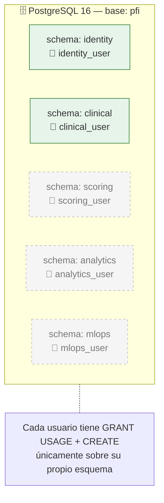

> Los esquemas `scoring`, `analytics` y `mlops` están **preaprovisionados pero vacíos**
> (servicios en estado esqueleto). Las secciones 5–7 documentan su **modelo de datos
> objetivo (v2.1)**, aún no implementado.

---

## 2. Esquema `identity` 🟢

> 🖼️ Imagen renderizada: [`img/05-er-identity.png`](img/05-er-identity.png) · vectorial: [`img/05-er-identity.svg`](img/05-er-identity.svg)

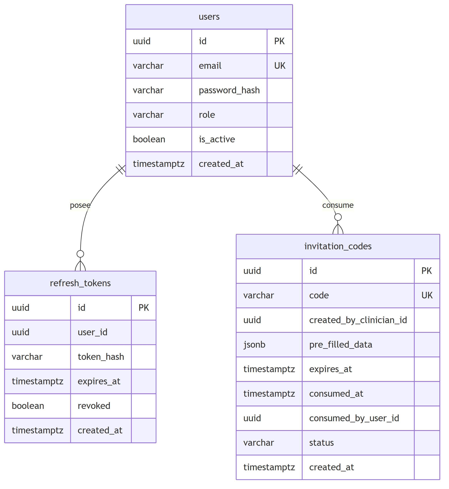

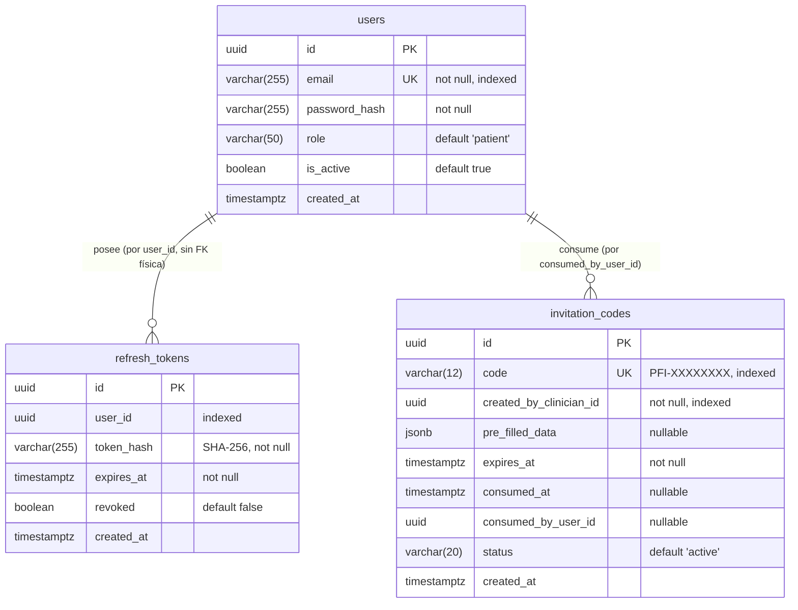

### 2.1. Extensiones objetivo del esquema `identity` 🟡

Entidades planificadas para el alcance v2.1 (consentimientos, tutela de menores y mapa de
seudónimos). Aún **no implementadas**.

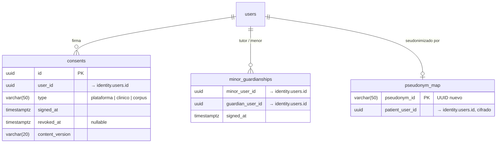

> `pseudonym_map` es el **único** punto donde se resuelve seudónimo → paciente; accesible
> solo por `identity-service` para revocación de consentimiento. Al revocarse el
> consentimiento de corpus, `identity-service` emite `CorpusConsentRevoked{pseudonym_id}`.

---

## 3. Esquema `clinical` 🟢

> 🖼️ Imagen renderizada: [`img/06-er-clinical.png`](img/06-er-clinical.png) · vectorial: [`img/06-er-clinical.svg`](img/06-er-clinical.svg)

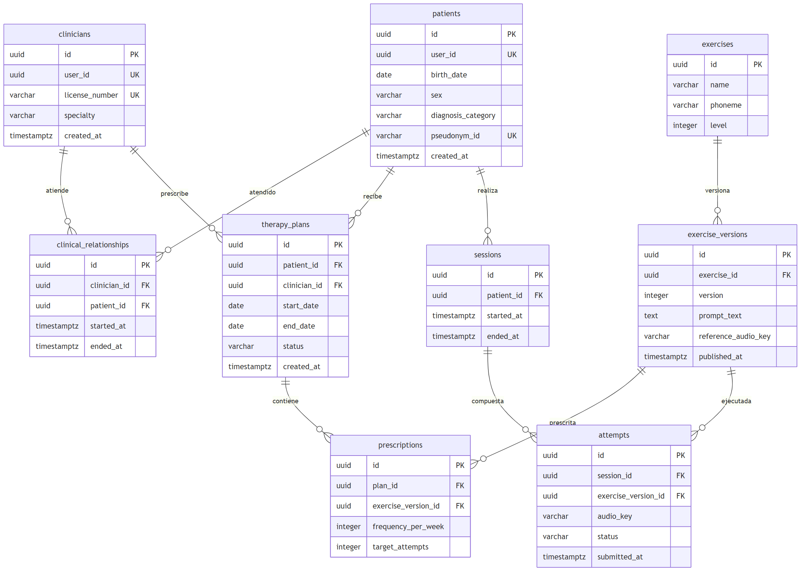

> **Objetivo v2.1:** `attempts.status` se convierte en una máquina de estados más rica —
> `pending → processing → scored | failed | rejected_quality` — donde solo
> `clinical-service` escribe `pending` y las transiciones posteriores las gatilla el
> consumo del evento `AttemptScored` (cada servicio escribe únicamente su schema).

---

## 4. Esquema `scoring` 🟡 (planificado)

> 🖼️ Imagen renderizada: [`img/16-er-scoring.png`](img/16-er-scoring.png) · vectorial: [`img/16-er-scoring.svg`](img/16-er-scoring.svg)

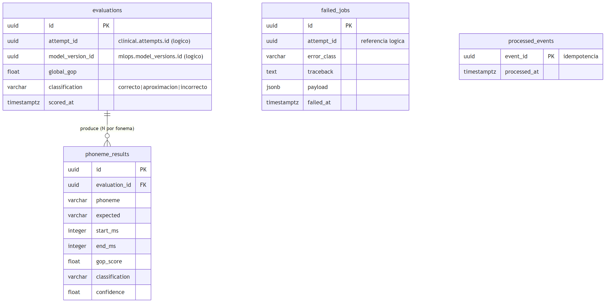

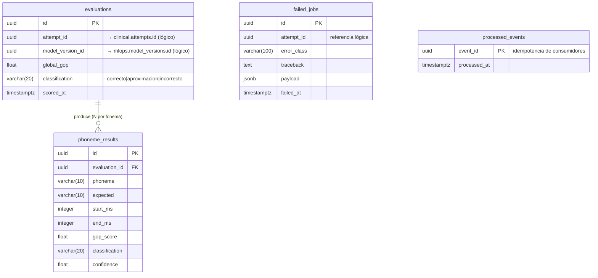

| Entidad | Propósito |
|---------|-----------|
| `evaluations` | Resultado global de un intento: GOP global + clasificación + modelo usado |
| `phoneme_results` | Desglose fonema a fonema: ventana temporal, GOP, clasificación, confianza |
| `failed_jobs` | *Dead-letter*: intentos que fallaron tras los reintentos del worker |
| `processed_events` | Tabla de idempotencia (evita reprocesar el mismo `AttemptCreated`) |

---

## 5. Esquema `analytics` 🟡 (planificado)

> 🖼️ Imagen renderizada: [`img/17-er-analytics.png`](img/17-er-analytics.png) · vectorial: [`img/17-er-analytics.svg`](img/17-er-analytics.svg)

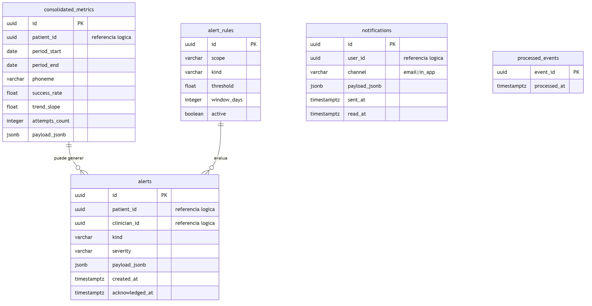

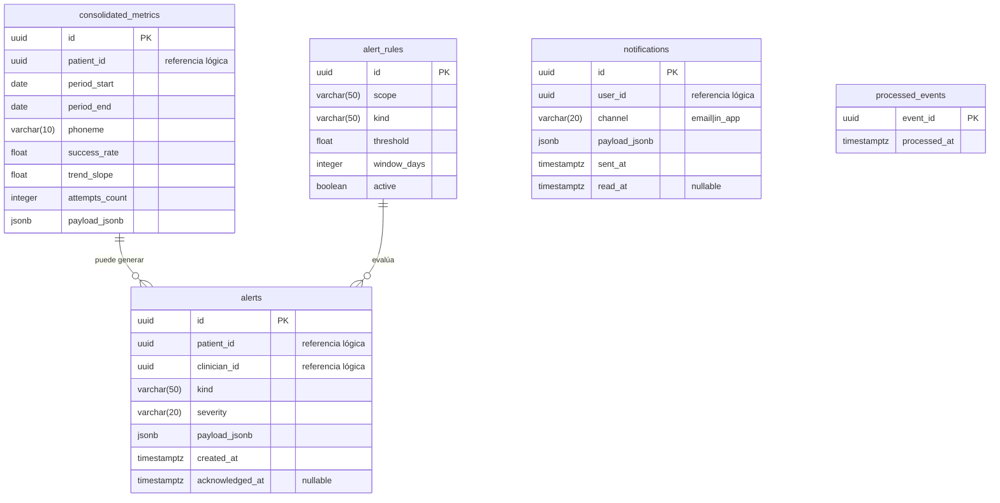

| Entidad | Propósito |
|---------|-----------|
| `consolidated_metrics` | Agregado longitudinal por paciente/fonema/período (tasa de éxito, tendencia) |
| `alerts` | Alertas tempranas al clínico (regresión, estancamiento), con acuse de recibo |
| `alert_rules` | Reglas configurables (umbral, ventana) por admin o clínico |
| `notifications` | Notificaciones enviadas (email / in-app) con estado de lectura |
| `processed_events` | Idempotencia de consumo de eventos |

---

## 6. Esquema `mlops` 🟡 (planificado)

> 🖼️ Imagen renderizada: [`img/18-er-mlops.png`](img/18-er-mlops.png) · vectorial: [`img/18-er-mlops.svg`](img/18-er-mlops.svg)

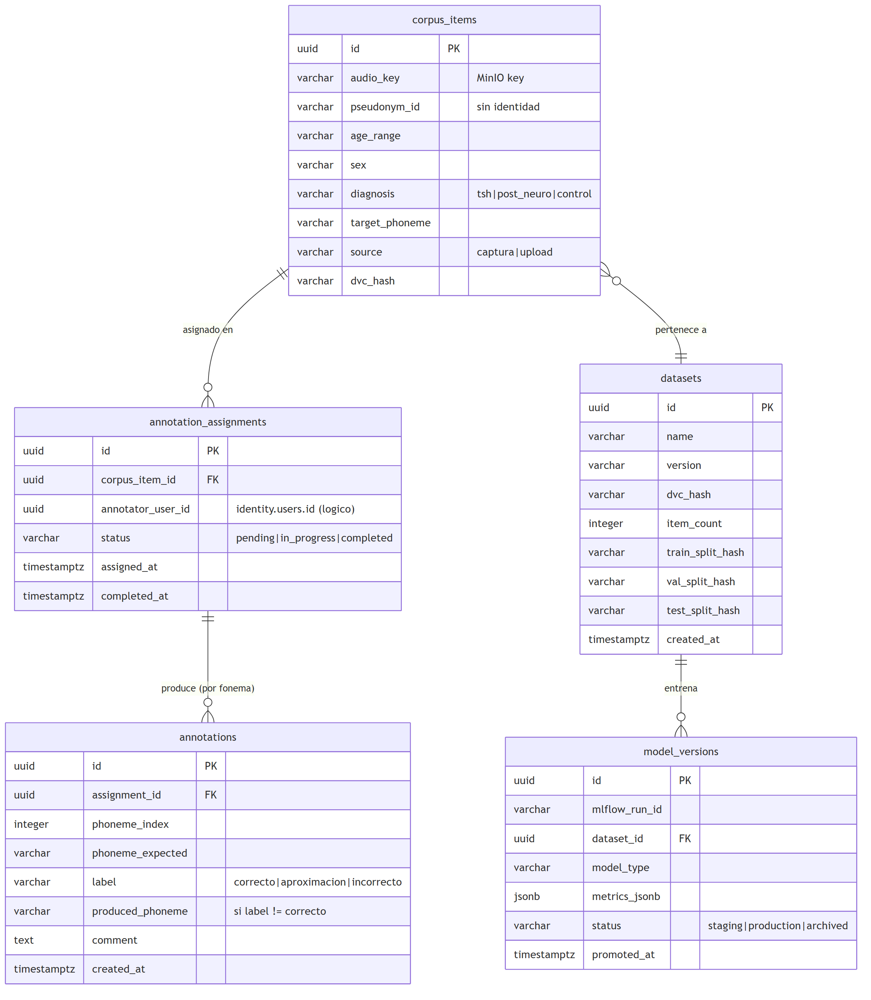

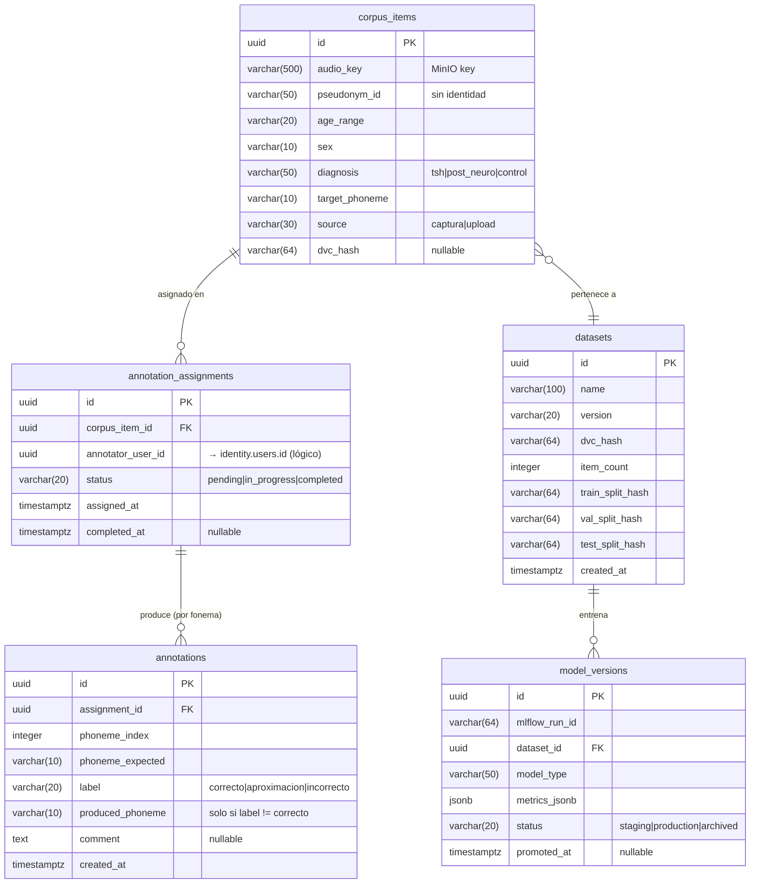

| Entidad | Propósito |
|---------|-----------|
| `corpus_items` | Ítem del corpus anonimizado (audio + metadatos, sin identidad) |
| `annotation_assignments` | Asignación de un ítem a un anotador (solapamiento 2+ para IRR) |
| `annotations` | Juicio fonema a fonema (escala ordinal + fonema producido) — **módulo propio, sin Label Studio** |
| `datasets` | Dataset congelado y versionado con DVC (splits train/val/test) |
| `model_versions` | Versionado de modelos: run MLflow, métricas, estado de promoción |

> ⚠️ **Reingeniería v2.1:** las tablas `label_studio_*` que la versión anterior preveía
> quedan **descartadas**. La anotación se registra directamente en `mlops.annotations`
> mediante el módulo propio; Cohen kappa (IRR) se calcula con una consulta sobre el
> schema, sin exportar/importar JSON de una herramienta externa. MLflow persiste sus
> tablas internas bajo `mlops.mlflow_*`.

---

## 7. Relaciones entre esquemas (cross-service)

> 🖼️ Imagen renderizada: [`img/19-er-global-futuro.png`](img/19-er-global-futuro.png) · vectorial: [`img/19-er-global-futuro.svg`](img/19-er-global-futuro.svg)

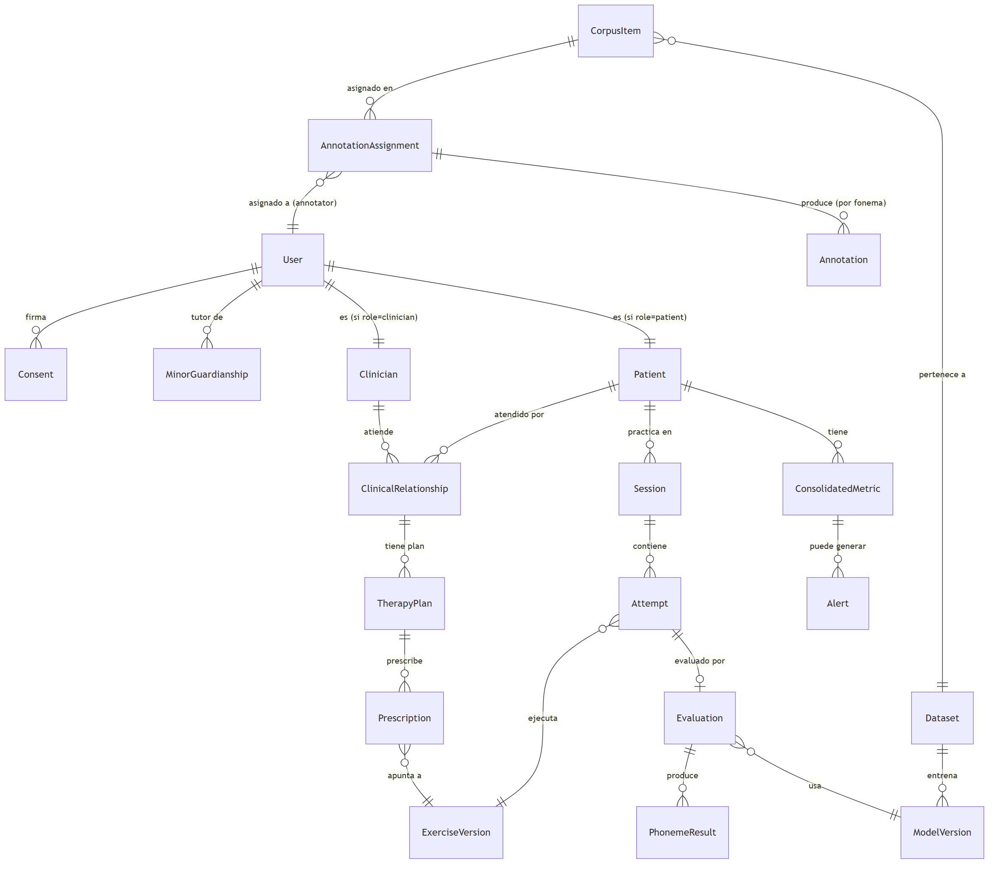

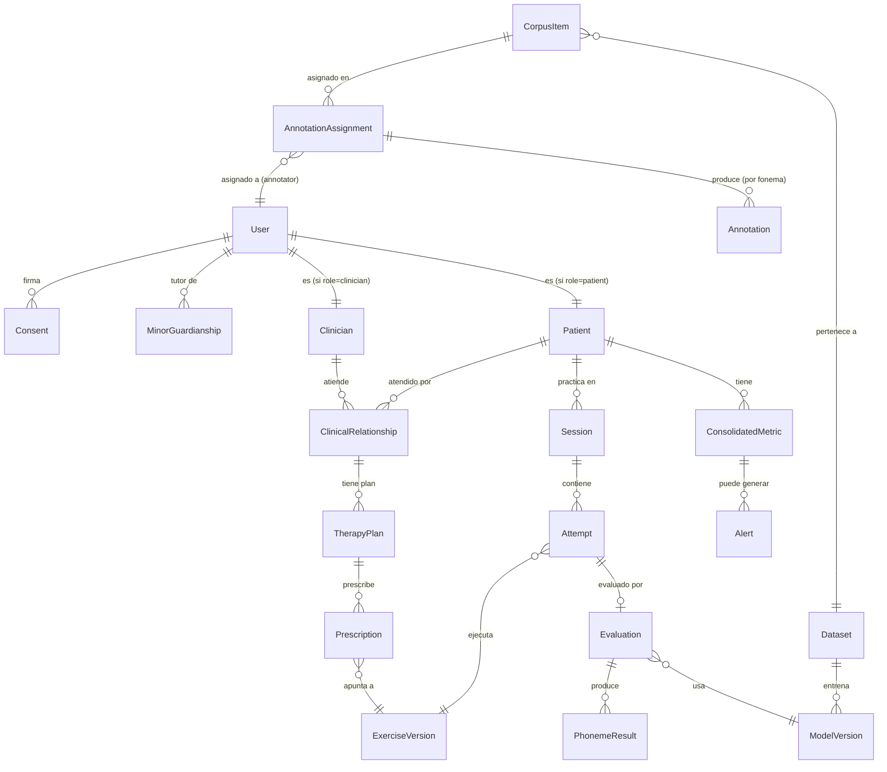

Distribución por schema:

| Schema | Entidades principales |
|---|---|
| `identity` | User, Role, Consent, MinorGuardianship, RefreshToken, PseudonymMap |
| `clinical` | Patient, Clinician, ClinicalRelationship, TherapyPlan, Prescription, Exercise, ExerciseVersion, Session, Attempt |
| `scoring` | Evaluation, PhonemeResult, FailedJob, ProcessedEvent |
| `analytics` | ConsolidatedMetric, Alert, AlertRule, Notification, ProcessedEvent |
| `mlops` | CorpusItem, AnnotationAssignment, Annotation, Dataset, ModelVersion, mlflow_* |

> **Importante:** las relaciones entre esquemas de servicios distintos (por ejemplo,
> `scoring.evaluations.attempt_id` → `clinical.attempts.id`, o
> `mlops.annotation_assignments.annotator_user_id` → `identity.users.id`) son **lógicas,
> no físicas**. El aislamiento por esquema y usuario impide declarar FK cross-schema. La
> consistencia se mantiene por eventos (Redis) y por convención de UUID. Esto es
> intencional en arquitecturas de microservicios (*schema/database per service*) y debe
> documentarse como decisión de diseño en la tesis.

---

## 8. Convenciones del modelo

| Convención | Detalle |
|------------|---------|
| **Clave primaria** | `UUID` v4 generado en aplicación (no autoincremental) |
| **Marcas temporales** | `timestamptz` (con zona horaria, en UTC) |
| **Datos semiestructurados** | `JSONB` para `pre_filled_data`, `payload_jsonb`, `metrics_jsonb`, resultados fonémicos heterogéneos |
| **Referencias a binarios** | `audio_key` / `reference_audio_key` guardan la **clave en MinIO**, no el binario |
| **Índices** | Sobre columnas de búsqueda: `email`, `code`, todas las FK, `user_id`, `pseudonym_id` |
| **Integridad referencial** | FK física **solo dentro** del mismo esquema; entre servicios es lógica |
| **Idempotencia** | Tabla `processed_events(event_id, processed_at)` por schema consumidor |

---

## 9. Herramientas recomendadas para graficar el modelo de base de datos

| Herramienta | Por qué | Costo | Ideal para |
|-------------|---------|-------|------------|
| **dbdiagram.io** | *DER como código* (lenguaje DBML), muy rápido, exporta a PNG/PDF/SQL. El favorito para modelos relacionales en tesis. | Gratis / Freemium | El diagrama ER "oficial" de la tesis |
| **DrawSQL** | Editor visual de ER muy prolijo, plantillas y exportación de calidad para láminas. | Freemium | Láminas de defensa presentables |
| **pgAdmin — ERD Tool** | Ya lo tenés en el `docker-compose`. Genera el ER **automáticamente por ingeniería inversa** desde la base real. | Gratis | Validar que el diagrama coincide con la BD real |
| **DBeaver** | Cliente universal; genera diagramas ER desde la conexión, exporta imagen. | Gratis (Community) | Ingeniería inversa rápida del esquema vivo |
| **MySQL Workbench / DBSchema** | Modelado ER visual con notación *crow's foot* formal. | Gratis / Pago | Notación ER clásica y rigurosa |
| **Mermaid** (usado aquí) | `erDiagram` versionable en el repo. | Gratis | Documentación en el repositorio |

> **Recomendación para la tesis:**
> 1. Mantené el **Mermaid** de este archivo como fuente versionada en el repo.
> 2. Para la lámina "oficial" del capítulo de base de datos, usá **dbdiagram.io** (DBML) o **DrawSQL** — producen el ER más limpio y presentable.
> 3. **Validá contra la base real** con la **herramienta ERD de pgAdmin** (que ya está en tu stack) o **DBeaver**: hacé ingeniería inversa del esquema realmente creado y comprobá que coincide con este diagrama (esquemas `identity` y `clinical`). Los esquemas `scoring`, `analytics` y `mlops` reflejan el **modelo objetivo v2.1**, aún no materializado.
