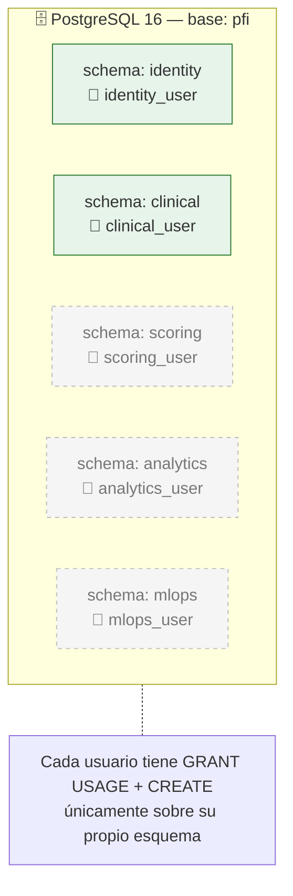
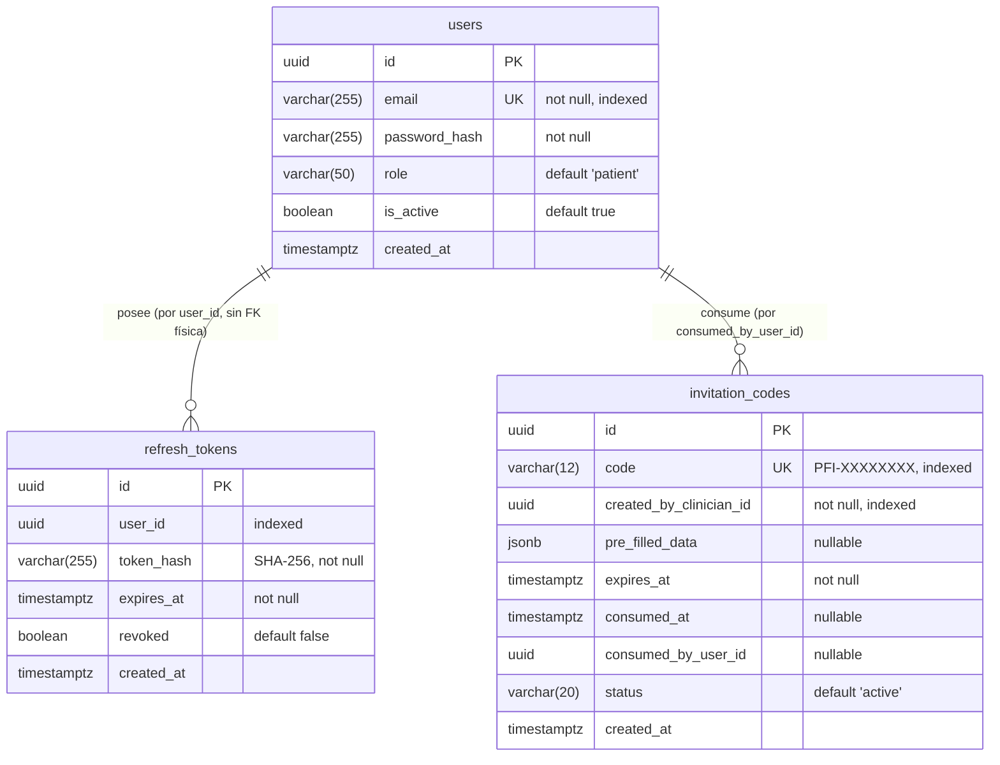
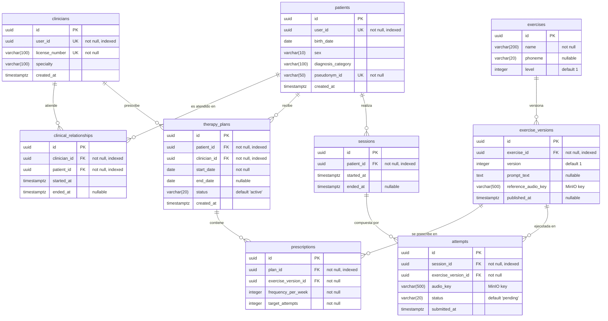
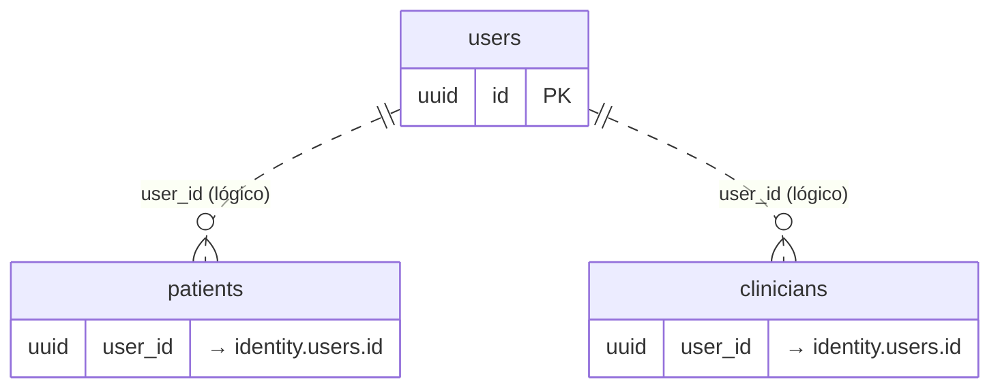

# Diagrama de Base de Datos (Modelo Entidad-Relación) — Plataforma PFI

> Diagrama Entidad-Relación (ER) del modelo físico de datos, derivado de los modelos
> ORM SQLAlchemy y del script de inicialización `infra/postgres/init.sql`.
>
> La base es una **única instancia PostgreSQL 16** particionada en **cinco esquemas**
> (uno por microservicio). Cada esquema es accedido por un usuario de base de datos
> dedicado con permisos restringidos (principio de mínimo privilegio).
>
> Sintaxis: **Mermaid** (`erDiagram`).

---

## 1. Organización física (esquemas y usuarios)

> Los esquemas `scoring`, `analytics` y `mlops` están **preaprovisionados pero vacíos**
> (servicios en estado esqueleto).

---

## 2. Esquema `identity`

> 🖼️ Imagen renderizada: [`img/05-er-identity.png`](img/05-er-identity.png) · vectorial: [`img/05-er-identity.svg`](img/05-er-identity.svg)

---

## 3. Esquema `clinical`

> 🖼️ Imagen renderizada: [`img/06-er-clinical.png`](img/06-er-clinical.png) · vectorial: [`img/06-er-clinical.svg`](img/06-er-clinical.svg)

---

## 4. Relaciones entre esquemas (cross-service)

> **Importante:** las relaciones entre `identity.users` y `clinical.patients/clinicians`
> son **lógicas, no físicas**. El aislamiento por esquema y usuario impide declarar una
> FK entre esquemas de distintos servicios. La consistencia se mantiene por eventos
> (Redis) y por convención de UUID. Esto es intencional en arquitecturas de microservicios
> (*database per service*) y debe documentarse como decisión de diseño en la tesis.

---

## 5. Convenciones del modelo

| Convención | Detalle |
|------------|---------|
| **Clave primaria** | `UUID` v4 generado en aplicación (no autoincremental) |
| **Marcas temporales** | `timestamptz` (con zona horaria, en UTC) |
| **Datos semiestructurados** | `JSONB` para `pre_filled_data` (flexibilidad de esquema) |
| **Referencias a binarios** | `audio_key` / `reference_audio_key` guardan la **clave en MinIO**, no el binario |
| **Índices** | Sobre columnas de búsqueda: `email`, `code`, todas las FK, `user_id`, `pseudonym_id` |
| **Integridad referencial** | FK física **solo dentro** del mismo esquema; entre servicios es lógica |

---

## 6. Herramientas recomendadas para graficar el modelo de base de datos

| Herramienta | Por qué | Costo | Ideal para |
|-------------|---------|-------|------------|
| **dbdiagram.io** | *DER como código* (lenguaje DBML), muy rápido, exporta a PNG/PDF/SQL. El favorito para modelos relacionales en tesis. | Gratis / Freemium | El diagrama ER "oficial" de la tesis |
| **DrawSQL** | Editor visual de ER muy prolijo, plantillas y exportación de calidad para láminas. | Freemium | Láminas de defensa presentables |
| **pgAdmin — ERD Tool** | Ya lo tenés en el `docker-compose`. Genera el ER **automáticamente por ingeniería inversa** desde la base real. | Gratis | Validar que el diagrama coincide con la BD real |
| **DBeaver** | Cliente universal; genera diagramas ER desde la conexión, exporta imagen. | Gratis (Community) | Ingeniería inversa rápida del esquema vivo |
| **MySQL Workbench / DBSchema** | Modelado ER visual con notación *crow's foot* formal. | Gratis / Pago | Notación ER clásica y rigurosa |
| **Mermaid** (usado aquí) | `erDiagram` versionable en el repo. | Gratis | Documentación en el repositorio |

> **Recomendación para la tesis:**
> 1. Mantené el **Mermaid** de este archivo como fuente versionada en el repo.
> 2. Para la lámina "oficial" del capítulo de base de datos, usá **dbdiagram.io** (DBML) o **DrawSQL** — producen el ER más limpio y presentable.
> 3. **Validá contra la base real** con la **herramienta ERD de pgAdmin** (que ya está en tu stack) o **DBeaver**: hacé ingeniería inversa del esquema realmente creado y comprobá que coincide con este diagrama. Eso le da rigor de "modelo verificado" a tu tesis.
