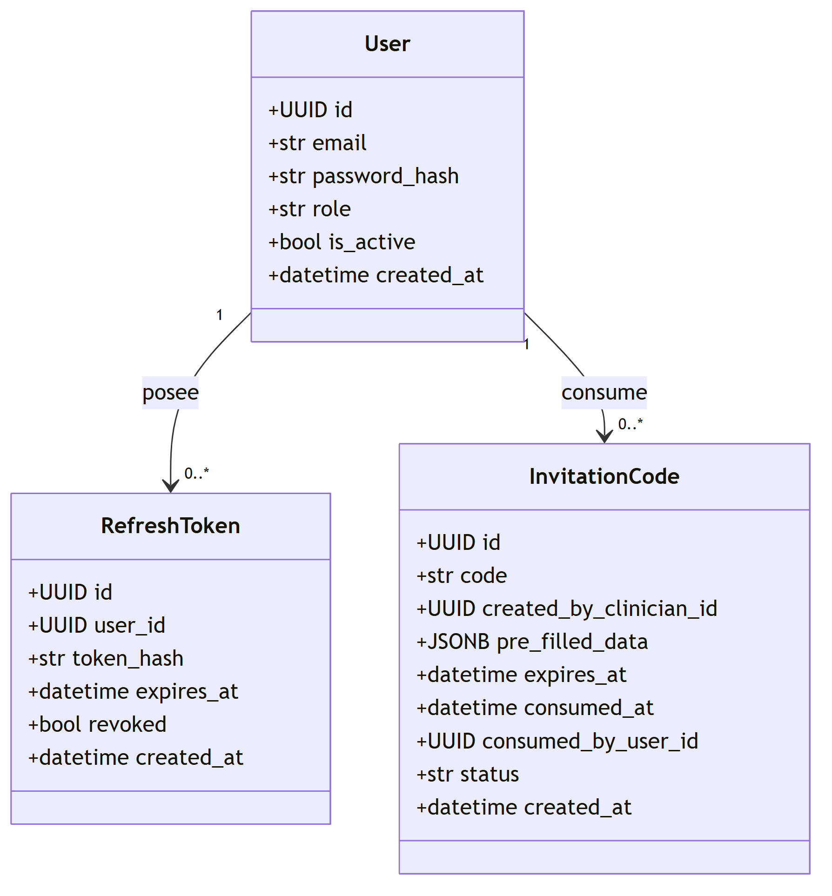
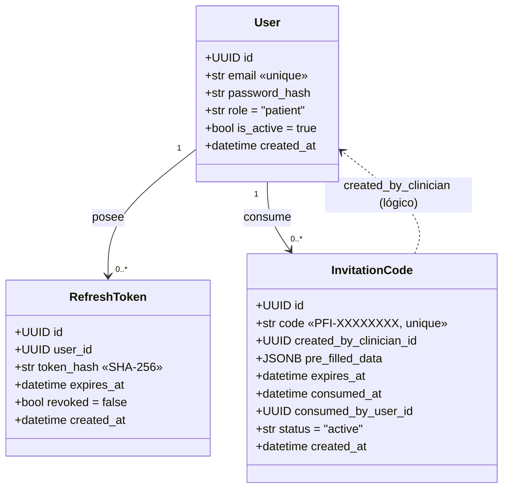
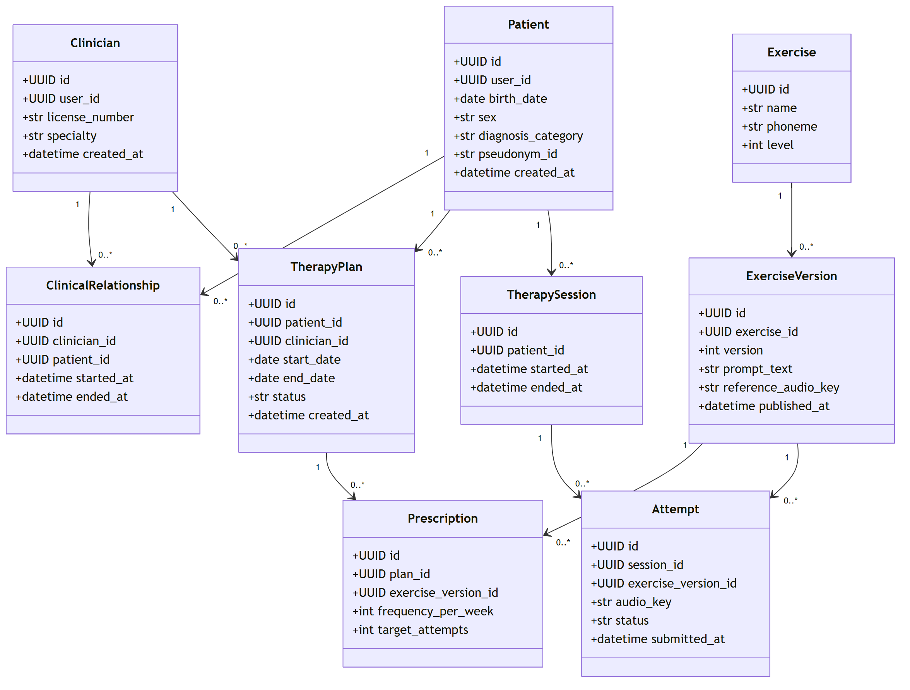
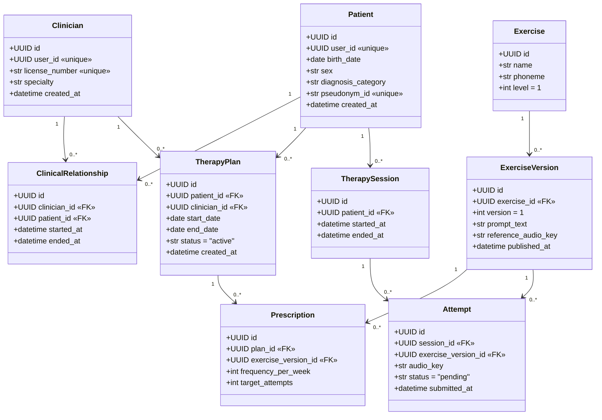
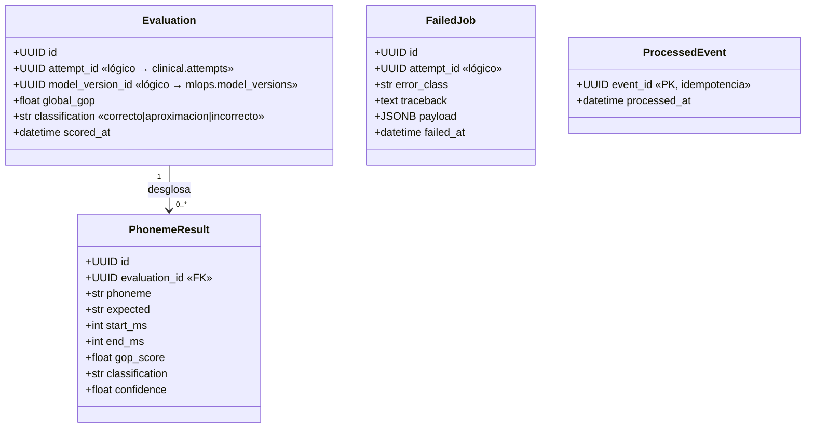
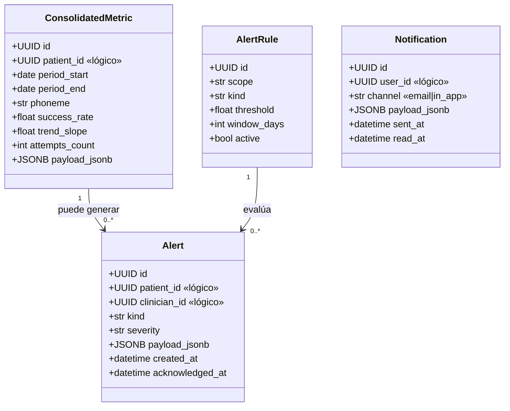
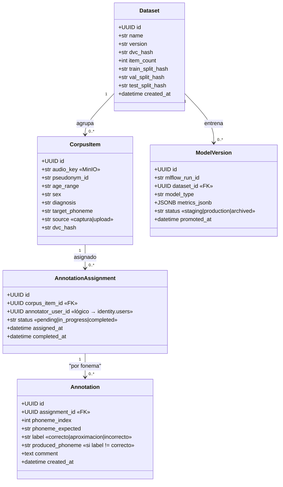
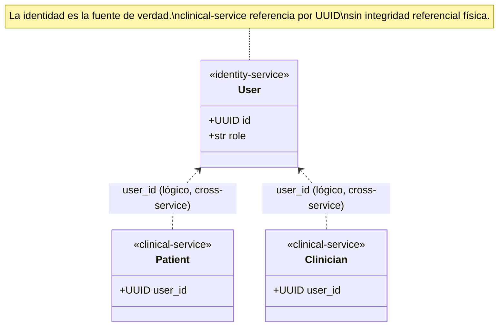

# Diagrama de Clases (UML) — Plataforma PFI

> Diagrama de clases UML que representa el modelo de dominio del backend, derivado de
> los modelos ORM SQLAlchemy (`models.py`) y los esquemas Pydantic (`schemas.py`) de
> cada microservicio.
>
> Sintaxis: **Mermaid** (`classDiagram`). Se muestran atributos, tipos y relaciones.
> Se omiten getters/setters por tratarse de entidades de datos (POPO/ORM).
>
> 🟢 = real / implementado · 🟡 = planificado (objetivo v2.1, ver
> [`Arquitectura-Logica.md`](Arquitectura-Logica.md)). Las secciones 3–6 documentan el
> modelo de dominio **objetivo** de los servicios en estado esqueleto.

---

## 1. Módulo de Identidad (`identity-service`) 🟢

> 🖼️ Imagen renderizada: [`img/03-clases-identity.png`](img/03-clases-identity.png) · vectorial: [`img/03-clases-identity.svg`](img/03-clases-identity.svg)

**Notas de diseño:**
- `RefreshToken.user_id` e `InvitationCode.consumed_by_user_id` referencian a `User`
  por UUID pero **sin FK física** (desacoplamiento; la integridad es lógica).
- `status` de `InvitationCode` es una máquina de estados: `active → consumed | revoked | expired`.

---

## 2. Módulo Clínico (`clinical-service`) 🟢

> 🖼️ Imagen renderizada: [`img/04-clases-clinical.png`](img/04-clases-clinical.png) · vectorial: [`img/04-clases-clinical.svg`](img/04-clases-clinical.svg)

**Notas de diseño:**
- `Patient.user_id` y `Clinician.user_id` referencian al `User` del `identity-service`
  (relación **entre servicios**, sin FK física — el aislamiento por esquema lo impide por diseño).
- Los enumerados están tipados en `schemas.py`: `SexEnum`, `PlanStatus`
  (`active/paused/completed/cancelled`), `AttemptStatus` (`pending/reviewed`).
- `ExerciseVersion` implementa el patrón de **versionado**: un `Exercise` conceptual
  con múltiples versiones publicables.

---

## 3. Módulo de Scoring (`scoring-service`) 🟡

> Modelo de dominio **planificado** (v2.1). Aún no existe en el código.

**Notas:** `scoring-service` se compone de `scoring-api` (FastAPI, SSE) + `scoring-worker`
(Celery). Consume `AttemptCreated`, publica `AttemptScored` / `AttemptFailed`.

---

## 4. Módulo de Analytics (`analytics-service`) 🟡

> Modelo de dominio **planificado** (v2.1). Aún no existe en el código.

**Notas:** consume `AttemptScored`, `AttemptFailed`, `PrescriptionUpdated`; publica
`AlertRaised`. Incluye scheduler (APScheduler) y notificador SMTP.

---

## 5. Módulo de MLOps (`mlops-service`) 🟡

> Modelo de dominio **planificado** (v2.1). ⚠️ **Se descarta Label Studio**: la anotación
> es un módulo propio (UI en la SPA + API en `mlops-service`).

**Notas:** publica `ModelPromoted` (consumido por `scoring-service`). Empaqueta MLflow
(registry) y DVC (versionado de datasets). El solapamiento de asignaciones a 2+
anotadores habilita el cálculo de IRR (Cohen kappa) por consulta directa al schema.

---

## 6. Vista de contexto entre servicios (relaciones lógicas)

---

## 7. Herramientas recomendadas para graficar diagramas de clases

| Herramienta | Por qué | Costo | Ideal para |
|-------------|---------|-------|------------|
| **Mermaid** (usado aquí) | `classDiagram` como código, versionable, se renderiza en GitHub/VS Code. | Gratis | Repo y tesis |
| **PlantUML** | El estándar UML como código: soporta clases con visibilidad, estereotipos, herencia, cardinalidades formales. Muy valorado académicamente. | Gratis | Diagramas UML rigurosos para el tribunal |
| **StarUML** | Herramienta UML de escritorio completa (todos los diagramas UML 2.x). Exporta a imagen/PDF. | Pago (prueba gratis) | Modelado UML formal y completo |
| **Visual Paradigm** | Suite UML profesional; tiene **edición Community gratuita** para uso académico. Genera código y viceversa. | Freemium | Tesis que exige notación UML estricta |
| **draw.io / diagrams.net** | Tiene plantillas UML; edición visual libre. | Gratis | Diagramas de clases presentables sin escribir código |
| **dbdiagram / DrawSQL** | *(Solo si el foco es el modelo de datos, no las clases de dominio.)* | Freemium | Ver archivo de base de datos |

> **Recomendación para la tesis:** para un diagrama de clases con notación UML formal
> (visibilidad `+/-`, estereotipos `«FK»`, cardinalidades), **PlantUML** o **Visual
> Paradigm (Community)** son la mejor elección académica. Mantené el Mermaid en el repo
> como fuente versionada y generá la lámina UML formal con PlantUML.
