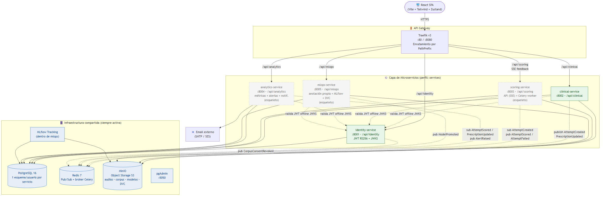
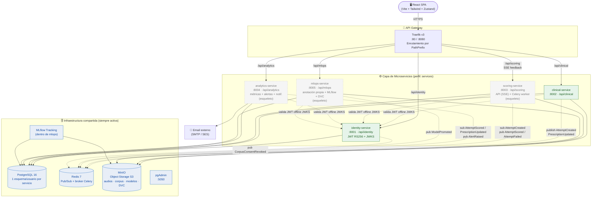
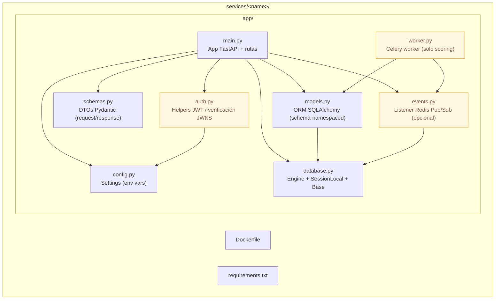
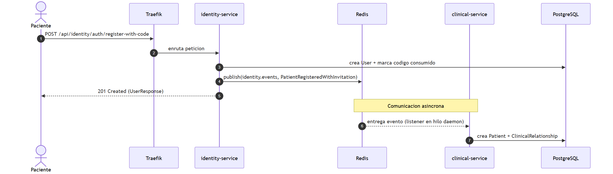
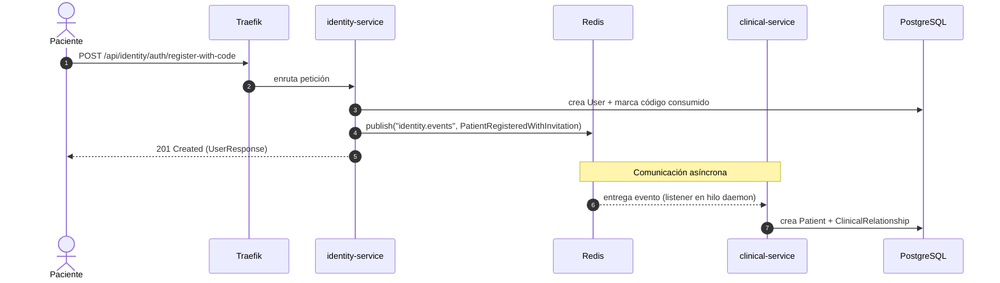

# Diagrama de Estructura y Arquitectura — Plataforma PFI

> Diagrama de arquitectura de despliegue (*deployment / component diagram*) que
> representa la estructura del sistema: frontend, microservicios, infraestructura
> compartida, canales de comunicación y límites de aislamiento.
>
> **Versión de arquitectura: 2.1 (Julio 2026)** — reingeniería del subsistema de
> anotación: se descarta **Label Studio** y se adopta un **módulo de anotación propio**
> integrado en la SPA + `mlops-service`. Ver documento canónico
> [`Arquitectura-Logica.md`](Arquitectura-Logica.md).
>
> Sintaxis: **Mermaid** (se renderiza en GitHub, GitLab, VS Code con extensión, Obsidian, etc.).

---

## 1. Vista general de la arquitectura (objetivo v2.1)

> 🖼️ Imagen renderizada: [`img/01-arquitectura.png`](img/01-arquitectura.png) · vectorial: [`img/01-arquitectura.svg`](img/01-arquitectura.svg)

> **Nota de transición:** en el repositorio actual el `docker-compose.yml` todavía
> incluye el contenedor **Label Studio** (usado en la fase exploratoria para prototipar
> el esquema de anotación) y los microservicios `scoring`/`analytics`/`mlops` están en
> estado **esqueleto**. El diagrama representa la **arquitectura objetivo v2.1**: la
> anotación pasa a ser un módulo propio dentro de `mlops-service` + la SPA, y Label
> Studio se retira. Ver [`Arquitectura-Logica.md` §5.2](Arquitectura-Logica.md).

---

## 2. Vista de estructura interna de un microservicio

Todos los servicios comparten la misma estructura de carpetas (patrón homogéneo). El
`scoring-service` agrega, además, un proceso **worker** (Celery) que comparte codebase y
schema con la API.

---

## 3. Flujo de comunicación por evento (registro por invitación) 🟢

> 🖼️ Imagen renderizada: [`img/02-flujo-invitacion.png`](img/02-flujo-invitacion.png) · vectorial: [`img/02-flujo-invitacion.svg`](img/02-flujo-invitacion.svg)

> Este flujo es **real / implementado** y no cambia con la arquitectura v2.1.

---

## 4. Canales de comunicación (resumen)

| Canal | Tipo | Origen → Destino | Tecnología | Estado |
|-------|------|-------------------|-----------|--------|
| API REST | Síncrono | SPA → Servicio | HTTP vía Traefik | 🟢 |
| Feedback en vivo | Streaming | scoring → SPA | **SSE** (Server-Sent Events) | 🟡 |
| Bus de eventos | Asíncrono | Servicio → Servicio | Redis Pub/Sub | 🟢 (1 evento) / 🟡 (resto) |
| Cola de tareas ML | Asíncrono | clinical → scoring-worker | Redis + Celery | 🟡 |
| Persistencia | — | Servicio → su esquema | PostgreSQL (aislamiento por usuario) | 🟢 |
| Object storage | — | clinical/scoring/mlops → objetos | MinIO (API S3) | 🟢 (provisto) |
| Autenticación | Sin estado | Cualquier servicio | JWT — **HS256 hoy → RS256 + JWKS objetivo** | 🟢 → 🟡 |

> **Autenticación — nota de evolución:** el código actual firma y valida JWT con
> **HS256 y clave secreta compartida**. La arquitectura objetivo v2.1 migra a **RS256
> con JWKS**: `identity-service` firma con clave privada y publica la clave pública en
> `GET /.well-known/jwks.json`; cada servicio valida offline sin round-trip.

---

## 5. Herramientas recomendadas para graficar este diagrama

Este es un **diagrama de arquitectura / despliegue / componentes**. Recomendaciones ordenadas por conveniencia para el proyecto:

| Herramienta | Por qué | Costo | Ideal para |
|-------------|---------|-------|------------|
| **Mermaid** (ya usado aquí) | Diagramas como código, versionable en Git, se renderiza solo en GitHub/VS Code. Cero mantenimiento visual. | Gratis / Open source | Incluir en la tesis y en el repo |
| **draw.io / diagrams.net** | Editor visual libre, exporta a PNG/SVG/PDF, tiene *stencils* de AWS/Docker/redes. Ideal para el diagrama "bonito" de la defensa. | Gratis | Láminas y anexos de la tesis |
| **Excalidraw** | Estilo "a mano alzada", muy claro para explicar arquitectura sin sobrecargar. Integración con VS Code. | Gratis | Explicaciones y pizarra conceptual |
| **PlantUML** | Diagramas de despliegue/componentes UML formales como código. | Gratis | Si tu tribunal exige notación UML estricta |
| **Structurizr** | Basado en el modelo **C4** (Context, Container, Component). El estándar moderno para documentar arquitecturas de microservicios. | Freemium | Elevar el nivel académico del capítulo de arquitectura |

> **Recomendación para la tesis:** mantené el **Mermaid** en el repositorio (trazable y versionado) y generá una versión pulida en **draw.io** para las láminas impresas. Si querés impresionar al tribunal en la parte de arquitectura, adoptá el **modelo C4** con Structurizr o con la librería `C4-PlantUML`. El documento canónico [`Arquitectura-Logica.md`](Arquitectura-Logica.md) ya incluye los diagramas C4 de nivel 1 (contexto) y 2 (contenedores).
