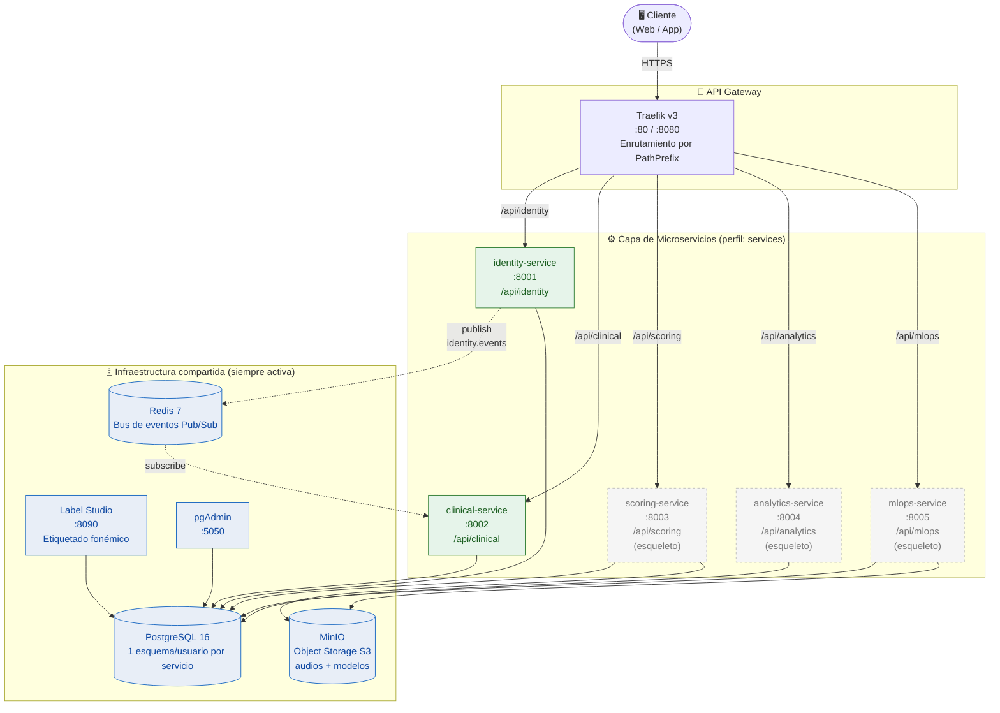
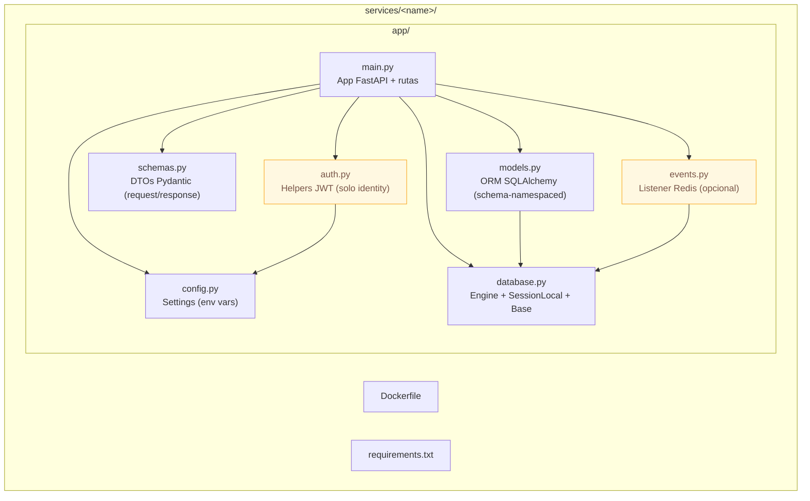
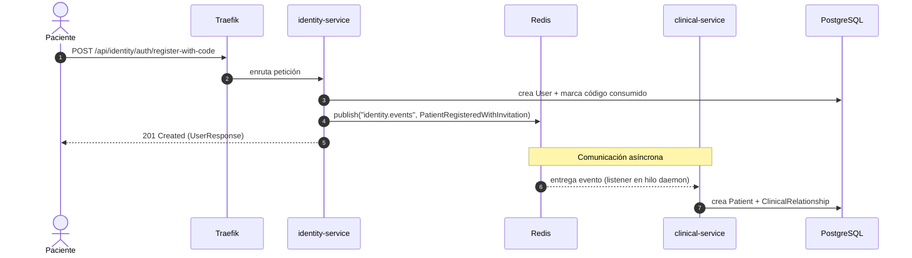

# Diagrama de Estructura y Arquitectura — Plataforma PFI

> Diagrama de arquitectura de despliegue (*deployment / component diagram*) que
> representa la estructura del backend: microservicios, infraestructura compartida,
> canales de comunicación y límites de aislamiento.
>
> Sintaxis: **Mermaid** (se renderiza en GitHub, GitLab, VS Code con extensión, Obsidian, etc.).

---

## 1. Vista general de la arquitectura

> 🖼️ Imagen renderizada: [`img/01-arquitectura.png`](img/01-arquitectura.png) · vectorial: [`img/01-arquitectura.svg`](img/01-arquitectura.svg)

---

## 2. Vista de estructura interna de un microservicio

Todos los servicios comparten la misma estructura de carpetas (patrón homogéneo):

---

## 3. Flujo de comunicación por evento (registro por invitación)

> 🖼️ Imagen renderizada: [`img/02-flujo-invitacion.png`](img/02-flujo-invitacion.png) · vectorial: [`img/02-flujo-invitacion.svg`](img/02-flujo-invitacion.svg)

---

## 4. Canales de comunicación (resumen)

| Canal | Tipo | Origen → Destino | Tecnología |
|-------|------|-------------------|-----------|
| API REST | Síncrono | Cliente → Servicio | HTTP vía Traefik |
| Bus de eventos | Asíncrono | identity → clinical | Redis Pub/Sub (`identity.events`) |
| Persistencia | — | Servicio → su esquema | PostgreSQL (aislamiento por usuario) |
| Object storage | — | scoring/mlops → objetos | MinIO (API S3) |
| Autenticación | Sin estado | Cualquier servicio | JWT HS256 (clave compartida) |

---

## 5. Herramientas recomendadas para graficar este diagrama

Este es un **diagrama de arquitectura / despliegue / componentes**. Recomendaciones ordenadas por conveniencia para el proyecto:

| Herramienta | Por qué | Costo | Ideal para |
|-------------|---------|-------|------------|
| **Mermaid** (ya usado aquí) | Diagramas como código, versionable en Git, se renderiza solo en GitHub/VS Code. Cero mantenimiento visual. | Gratis / Open source | Incluir en la tesis y en el repo |
| **draw.io / diagrams.net** | Editor visual libre, exporta a PNG/SVG/PDF, tiene *stencils* de AWS/Docker/redes. Ideal para el diagrama "bonito" de la defensa. | Gratis | Láminas y anexos de la tesis |
| **Excalidraw** | Estilo "a mano alzada", muy claro para explicar arquitectura sin sobrecargar. Integración con VS Code. | Gratis | Explicaciones y pizarra conceptual |
| **PlantUML** | Diagramas de despliegue/componentes UML formales como código. | Gratis | Si tu tribunal exige notación UML estricta |
| **Structurizr** | Basado en el modelo **C4** (Context, Container, Component). El estándar moderno para documentar arquitecturas de microservicios. | Freemium | Elevar el nivel académico del capítulo de arquitectura |

> **Recomendación para la tesis:** mantené el **Mermaid** en el repositorio (trazable y versionado) y generá una versión pulida en **draw.io** para las láminas impresas. Si querés impresionar al tribunal en la parte de arquitectura, adoptá el **modelo C4** con Structurizr o con la librería `C4-PlantUML`.
