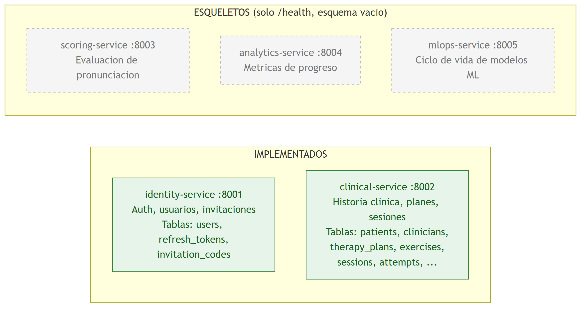
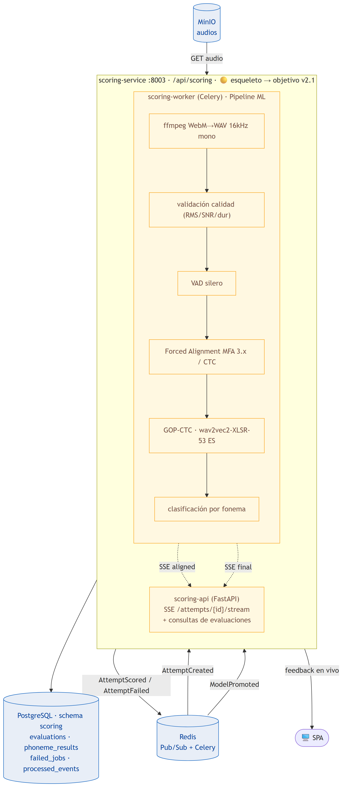
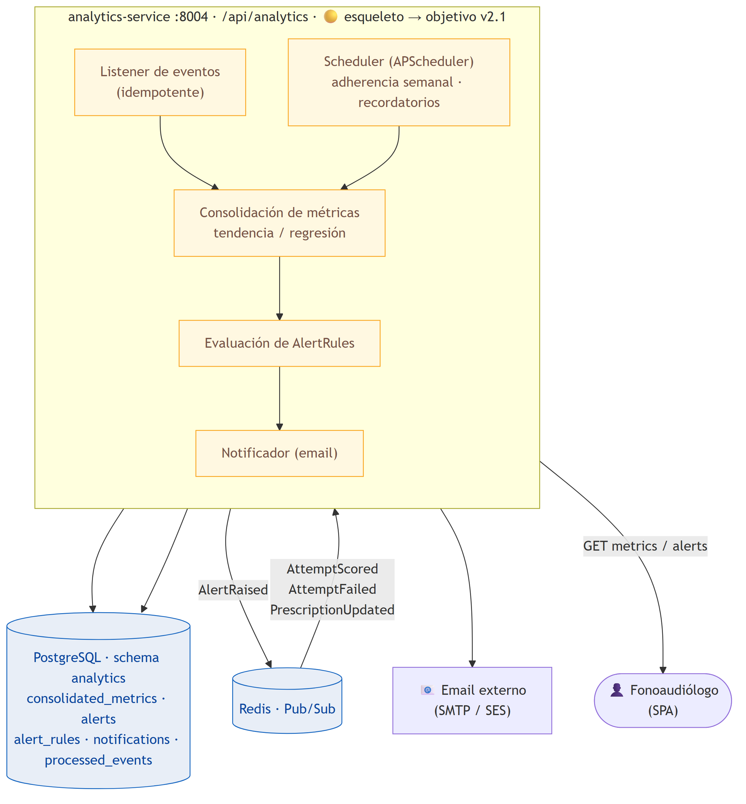
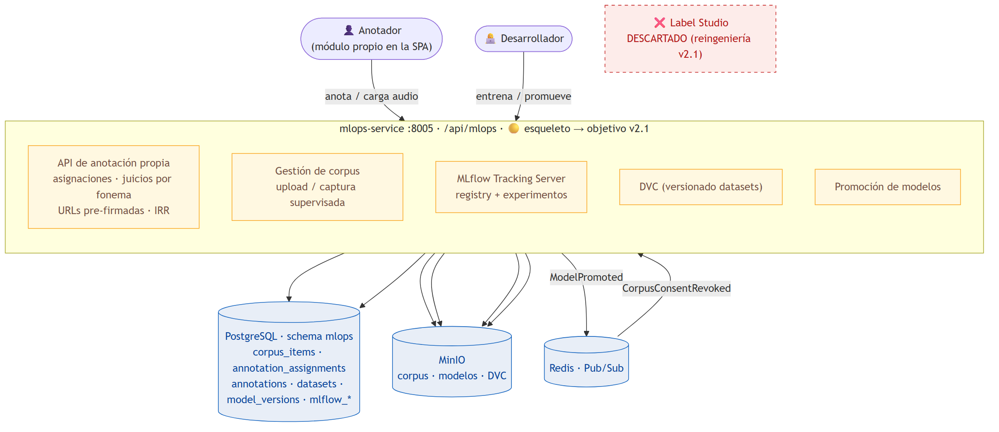

# Diagramas por Microservicio — Plataforma PFI

> Vista individual de cada uno de los cinco microservicios del backend, con su estado
> real de implementación y su **alcance objetivo según la arquitectura v2.1**. Los
> diagramas de clases y ER detallados de los servicios implementados están en
> `Diagrama-Clases.md` y `Diagrama-BaseDeDatos.md`.
>
> Documento canónico de arquitectura: [`Arquitectura-Logica.md`](Arquitectura-Logica.md).
>
> Todas las imágenes están en `docs/img/` en formato **PNG** (alta resolución) y
> **SVG** (vectorial, para impresión sin pérdida).

---

## 0. Estado global de los microservicios

| Servicio | Puerto | Estado | Tablas / componentes |
|----------|--------|--------|--------|
| `identity-service` | 8001 | ✅ Implementado | `users`, `refresh_tokens`, `invitation_codes` (objetivo: + `consents`, `minor_guardianships`, `pseudonym_map`) |
| `clinical-service` | 8002 | ✅ Implementado | `patients`, `clinicians`, `clinical_relationships`, `therapy_plans`, `exercises`, `exercise_versions`, `prescriptions`, `sessions`, `attempts` |
| `scoring-service` | 8003 | 🟡 Esqueleto | API (SSE) + Celery worker · MFA + wav2vec2 + GOP-CTC |
| `analytics-service` | 8004 | 🟡 Esqueleto | métricas consolidadas + alertas + notificaciones + scheduler |
| `mlops-service` | 8005 | 🟡 Esqueleto | anotación propia + MLflow + DVC (esquema vacío) |

---

## 1. identity-service ✅

Servicio de identidad, autenticación y códigos de invitación. Modelo de datos completo
para el alcance actual.

- **Diagrama de clases:** ver [`Diagrama-Clases.md` §1](Diagrama-Clases.md) → `img/03-clases-identity.png`
- **Diagrama ER:** ver [`Diagrama-BaseDeDatos.md` §2](Diagrama-BaseDeDatos.md) → `img/05-er-identity.png`

**Alcance objetivo v2.1:** fuente única de verdad de identidad y consentimientos. Emite
JWT **RS256** verificables offline por el resto vía **JWKS** (`GET /.well-known/jwks.json`).
Roles: `patient`, `guardian`, `clinician`, `annotator`, `admin`. Suma consentimientos
separados (`Consent`), tutela de menores (`MinorGuardianship`), mapa de seudónimos
(`pseudonym_map`) y MFA TOTP (obligatorio para `clinician`/`admin`). Publica el evento
`CorpusConsentRevoked` al revocarse la cesión de audios al corpus.

---

## 2. clinical-service ✅

Servicio de historia clínica, planes de terapia, ejercicios y sesiones. Modelo de datos
completo.

- **Diagrama de clases:** ver [`Diagrama-Clases.md` §2](Diagrama-Clases.md) → `img/04-clases-clinical.png`
- **Diagrama ER:** ver [`Diagrama-BaseDeDatos.md` §3](Diagrama-BaseDeDatos.md) → `img/06-er-clinical.png`

**Alcance objetivo v2.1:** agrupa los bounded contexts **Clinical + Exercise Catalog +
Practice** (transaccionalmente acoplados). Al recibir un intento (`POST /attempts`,
multipart con audio): valida JWT y prescripción, sube el audio a MinIO, inserta el
`Attempt` en estado `pending` y publica `AttemptCreated`. Consume `AttemptScored` para
transicionar el estado del `Attempt` (`pending → processing → scored | failed |
rejected_quality`), respetando la regla de que cada servicio solo escribe su propio
schema. Publica `PrescriptionUpdated` al ajustar un plan.

---

## 3. scoring-service 🟡

> **Estado actual:** esqueleto. El código contiene únicamente la app FastAPI con el
> endpoint `/health`; **no tiene `models.py` ni `schemas.py`** y su esquema de base de
> datos (`scoring`) está vacío. El diagrama documenta el estado real y el alcance
> planificado (aún **no implementado**).

**Responsabilidad objetivo (v2.1):** convertir un intento de audio en una evaluación
fonémica — es el **corazón ML** del sistema. Se compone de dos procesos en el mismo
paquete:

- **`scoring-api`** (FastAPI): expone el endpoint **SSE** `/attempts/{id}/stream` que
  envía feedback en vivo al paciente (`aligned` → `scored_phoneme` → `final`), y
  consultas sobre evaluaciones pasadas.
- **`scoring-worker`** (Celery): consume `AttemptCreated`, ejecuta el pipeline ML
  completo (ffmpeg → validación de calidad → VAD silero → Forced Alignment **MFA 3.x** /
  CTC-align → **GOP-CTC** sobre **wav2vec2-XLSR-53 español** → clasificación
  correcto/aproximación/incorrecto), persiste `Evaluation` + N `PhonemeResult` de forma
  atómica y publica `AttemptScored` / `AttemptFailed`.

Los modelos (~1.2 GB) se cargan **al startup del worker** y permanecen en memoria. El
aislamiento como microservicio es lo que permite escalar este componente (N réplicas del
worker) sin tocar el resto.

---

## 4. analytics-service 🟡

> **Estado actual:** esqueleto (solo `/health`, esquema `analytics` vacío). El diagrama
> muestra el estado real y el alcance planificado (**no implementado**).

**Responsabilidad objetivo (v2.1):** consolidar las evaluaciones individuales en métricas
longitudinales por paciente (`ConsolidatedMetric`), detectar tendencias (mejora /
estancamiento / regresión), disparar **alertas tempranas** (`Alert`, `AlertRule`) al
fonoaudiólogo y enviar **notificaciones** (`Notification`) por email. Consume
`AttemptScored`, `AttemptFailed` y `PrescriptionUpdated`; publica `AlertRaised`. Incluye
un **scheduler** (APScheduler) para métricas no event-driven (adherencia semanal,
recordatorios) y un **notificador** SMTP/SES. Agrupa **Analytics + Notifications**.

---

## 5. mlops-service 🟡

> **Estado actual:** esqueleto (solo `/health`, esquema `mlops` vacío).
>
> ⚠️ **Reingeniería v2.1 — se descarta Label Studio.** En la evaluación anterior este
> servicio empaquetaba **Label Studio** para el etiquetado fonémico. La arquitectura v2.1
> lo reemplaza por un **módulo de anotación propio** integrado en la plataforma (UI en la
> SPA + API en `mlops-service`). Label Studio se usó solo en la fase exploratoria para
> prototipar el esquema de anotación; ese prototipado permitió acotar la tarea (escala
> ordinal de 3 opciones por fonema + dropdown de fonema producido) al punto de hacer
> viable el módulo propio. En el `docker-compose.yml` actual el contenedor de Label
> Studio todavía figura; su retiro es parte de esta reingeniería.

**Responsabilidad objetivo (v2.1):** subsistema de gestión de corpus, anotación,
datasets y registry de modelos — usado por **anotadores** y desarrolladores, no por
pacientes ni clínicos en producción. Componentes:

- **Módulo de anotación propio** (API en `mlops-service`, UI en la SPA): asignaciones
  multi-anotador (`AnnotationAssignment`), juicios fonema a fonema (`Annotation`), alta
  de audios al corpus (`CorpusItem`) por upload directo o captura supervisada, URLs
  pre-firmadas de MinIO. Reutiliza identidad (rol `annotator`, JWT/RBAC) y el design
  system del frontend. Cohen kappa (IRR) se calcula con consulta directa sobre el schema.
- **MLflow Tracking Server**: registry de modelos y experimentos, backend Postgres
  (`mlops.mlflow_*`), artefactos en MinIO. Herramienta interna de desarrolladores.
- **DVC**: versionado de datasets con remote en MinIO (S3-compatible).

Publica `ModelPromoted` al promover un modelo a producción (consumido por
`scoring-service` para hacer el switch atómico del modelo activo). No consume eventos en
la versión inicial (servicio "frío").

---

## Índice de imágenes generadas

| # | Archivo | Descripción |
|---|---------|-------------|
| 01 | `img/01-arquitectura.*` | Arquitectura general del sistema (objetivo v2.1) |
| 02 | `img/02-flujo-invitacion.*` | Diagrama de secuencia del flujo de invitación |
| 03 | `img/03-clases-identity.*` | Diagrama de clases — identity-service |
| 04 | `img/04-clases-clinical.*` | Diagrama de clases — clinical-service |
| 05 | `img/05-er-identity.*` | Modelo ER — esquema identity |
| 06 | `img/06-er-clinical.*` | Modelo ER — esquema clinical |
| 07 | `img/07-scoring-service.*` | Estado y alcance — scoring-service |
| 08 | `img/08-analytics-service.*` | Estado y alcance — analytics-service |
| 09 | `img/09-mlops-service.*` | Estado y alcance — mlops-service |
| 10 | `img/10-estado-microservicios.*` | Estado global de los 5 microservicios |

*Cada entrada existe en `.png` (alta resolución 3x) y `.svg` (vectorial).*
