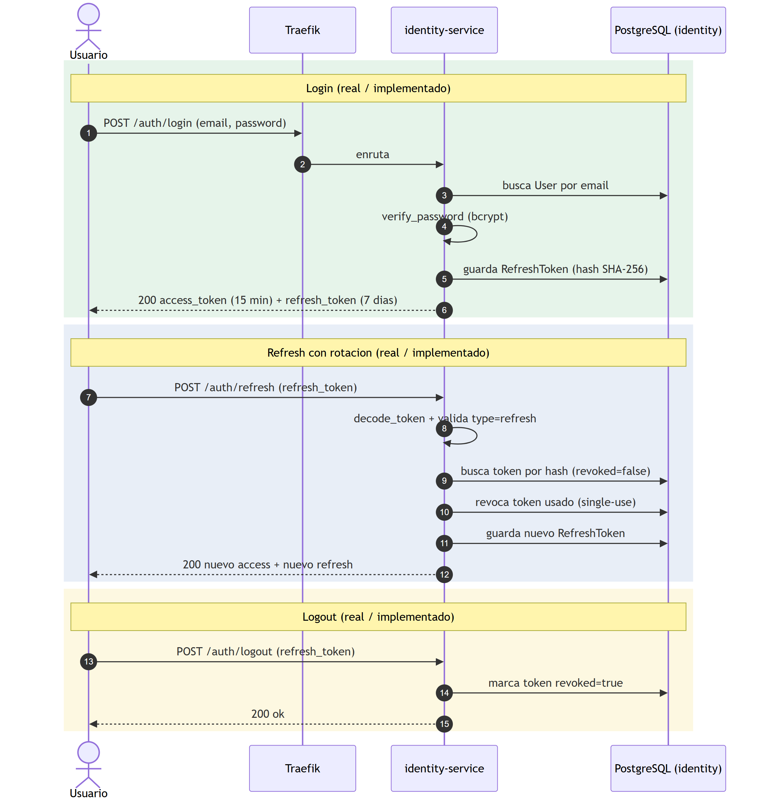
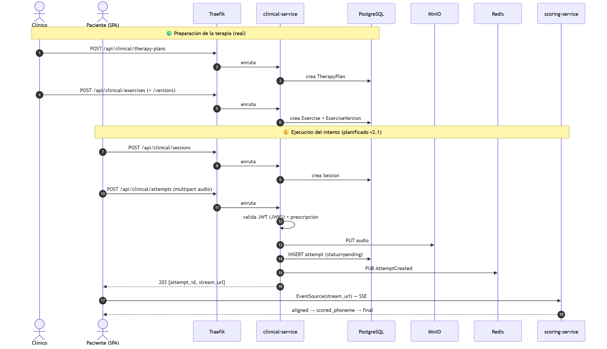
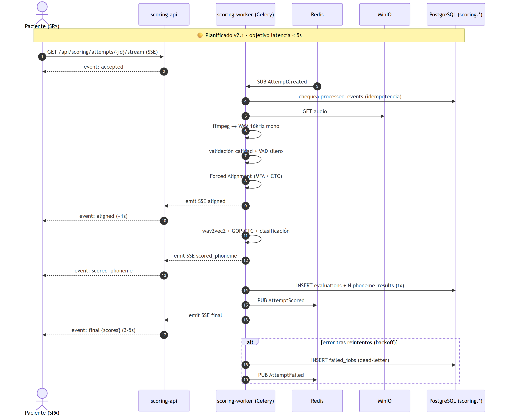
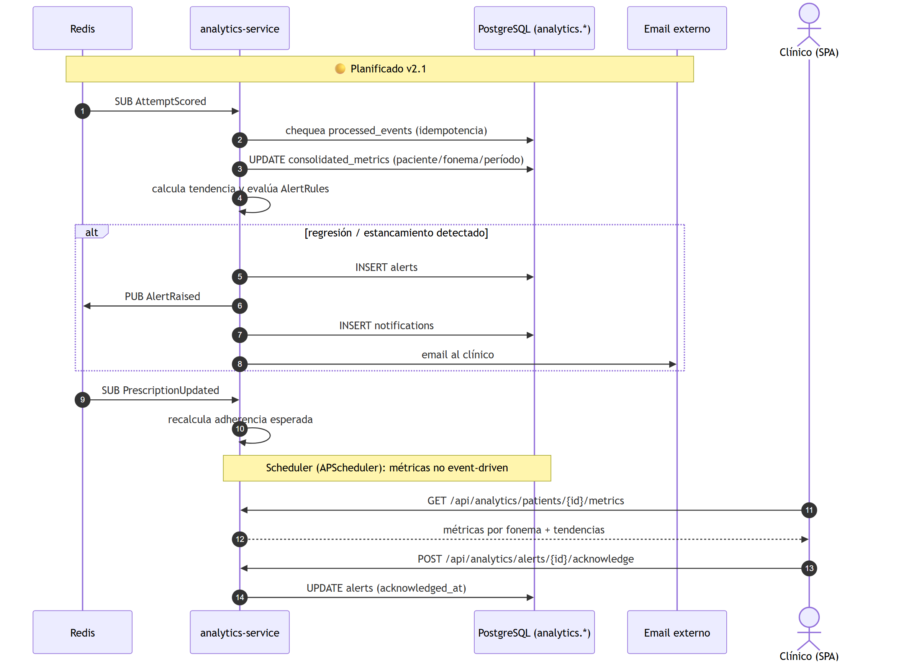
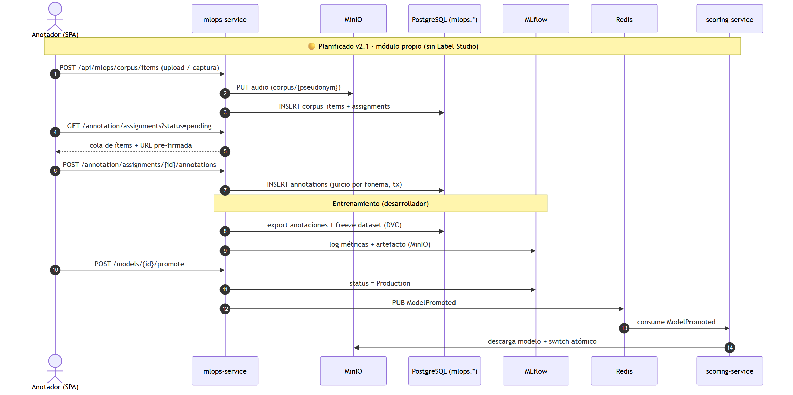
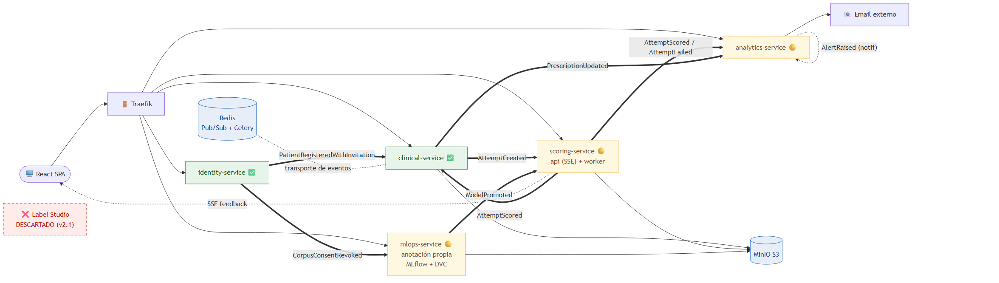

# Planificación de Diseño Futuro — Plataforma PFI

> Este documento reúne los diagramas de **flujo (secuencia)** y **modelo de datos (ER)**
> de **todos los microservicios**, incluyendo los que aún están en estado de esqueleto,
> alineados con la **arquitectura objetivo v2.1** ([`Arquitectura-Logica.md`](Arquitectura-Logica.md)).
>
> ⚠️ **Naturaleza del documento:** los diagramas se dividen en dos categorías:
> - 🟢 **Real / implementado** — refleja el código existente.
> - 🟡 **Planificado (no implementado)** — es una **propuesta de diseño** para guiar el
>   desarrollo futuro. Las entidades, endpoints y eventos aquí propuestos **aún no
>   existen en el código** y deben validarse antes de construirse.
>
> 🔁 **Reingeniería v2.1:** se descarta **Label Studio** en favor de un **módulo de
> anotación propio** (UI en la SPA + API en `mlops-service`); el JWT migra a **RS256 +
> JWKS**; el feedback al paciente se entrega por **SSE**; y se define el contrato de
> eventos completo del bus Redis.
>
> Imágenes en `docs/img/` (PNG alta resolución + SVG vectorial).

---

## 1. Flujos de los servicios implementados 🟢

### 1.1. Flujo de autenticación (identity-service) — real

Cubre login, refresh con rotación de tokens (single-use) y logout. Refleja el código real
de `identity-service/app/main.py`.

> **Objetivo v2.1:** migración de firma **HS256 (clave compartida)** a **RS256 + JWKS**
> (`GET /.well-known/jwks.json`), habilitando verificación offline en el resto de los
> servicios sin round-trip.

### 1.2. Flujo de terapia (clinical-service) — real + gancho futuro

Preparación de la terapia (plan, ejercicio, versión) y ejecución de la sesión (sesión →
intento). El bloque amarillo marca la parte **planificada**: la carga real del audio a
MinIO, el registro del `Attempt` en estado `pending`, la publicación del evento
`AttemptCreated` hacia `scoring-service` y la devolución del `stream_url` (SSE) al cliente.

---

## 2. scoring-service 🟡 (planificado)

### 2.1. Flujo de evaluación (pipeline ML + SSE)

`clinical-service` publica `AttemptCreated`; el **`scoring-worker`** (Celery) lo consume,
descarga el audio de MinIO y ejecuta el pipeline: ffmpeg (WebM→WAV 16 kHz) → validación de
calidad → VAD silero → Forced Alignment (MFA / CTC-align) → **GOP-CTC** sobre
**wav2vec2-XLSR-53 español** → clasificación por fonema. Persiste `Evaluation` + N
`PhonemeResult` (atómico), publica `AttemptScored` (o `AttemptFailed`) y emite los eventos
**SSE** (`aligned`, `scored_phoneme`, `final`) al navegador vía `scoring-api`.

### 2.2. Modelo de datos propuesto

| Entidad | Propósito |
|---------|-----------|
| `evaluations` | Resultado global: GOP global + clasificación + `model_version_id` usado |
| `phoneme_results` | Desglose fonema a fonema (ventana temporal, GOP, clasificación, confianza) |
| `failed_jobs` | *Dead-letter* de intentos fallidos tras reintentos con backoff |
| `processed_events` | Idempotencia del consumidor (evita reprocesar `AttemptCreated`) |

**Eventos:** consume `AttemptCreated`; publica `AttemptScored` y `AttemptFailed`. Consume
también `ModelPromoted` para actualizar el modelo activo en caliente.

---

## 3. analytics-service 🟡 (planificado)

### 3.1. Flujo de agregación de métricas y alertas

Consume `AttemptScored` → actualiza `consolidated_metrics` del paciente → evalúa
`alert_rules`. Si detecta regresión/estancamiento, inserta un `Alert`, publica
`AlertRaised` y envía la notificación por email (SMTP). Un **scheduler** (APScheduler)
recalcula métricas no event-driven (adherencia semanal, recordatorios).

### 3.2. Modelo de datos propuesto

| Entidad | Propósito |
|---------|-----------|
| `consolidated_metrics` | Agregados longitudinales por paciente/fonema/período (tasa de éxito, tendencia) |
| `alerts` | Alertas tempranas al clínico, con acuse de recibo (`acknowledged_at`) |
| `alert_rules` | Reglas configurables (umbral, ventana) por admin o clínico |
| `notifications` | Notificaciones enviadas (email / in-app) con estado de lectura |
| `processed_events` | Idempotencia de consumo de eventos |

**Eventos:** consume `AttemptScored`, `AttemptFailed`, `PrescriptionUpdated`; publica
`AlertRaised`. Agrupa **Analytics + Notifications**.

---

## 4. mlops-service 🟡 (planificado)

### 4.1. Flujo del ciclo de vida del modelo y anotación propia

⚠️ **Se descarta Label Studio.** El anotador (rol `annotator`) trabaja **dentro de la
SPA**: recibe su cola de `annotation_assignments`, reproduce el audio con una URL
pre-firmada de MinIO y registra el juicio fonema a fonema (`correcto/aproximación/
incorrecto` + `produced_phoneme`) que se persiste atómicamente en `mlops.annotations`. Los
audios se cargan al corpus por upload directo o captura supervisada. El pipeline de
entrenamiento consume las anotaciones del schema, versiona el dataset con **DVC**, entrena
y registra el modelo en **MLflow**; al promoverlo publica `ModelPromoted`.

### 4.2. Modelo de datos propuesto

| Entidad | Propósito |
|---------|-----------|
| `corpus_items` | Ítem del corpus anonimizado (audio + metadatos, sin identidad) |
| `annotation_assignments` | Asignación de un ítem a un anotador (solapamiento 2+ para IRR) |
| `annotations` | Juicio fonema a fonema — **módulo propio, sin Label Studio** |
| `datasets` | Dataset congelado y versionado con DVC (splits train/val/test) |
| `model_versions` | Versionado de modelos: run MLflow, métricas, estado de promoción |

**Integración clave:** `scoring-service` consume `ModelPromoted` y carga la
`model_version` en `production` para inferir. MLflow persiste bajo `mlops.mlflow_*` y
guarda artefactos en MinIO; DVC usa MinIO como remote S3-compatible.

**Eventos:** publica `ModelPromoted`. Consume `CorpusConsentRevoked` (de `identity`) para
marcar como `revoked` los `corpus_items` del paciente que retira el consentimiento.

---

## 5. Vista integrada a futuro

### 5.1. Arquitectura de eventos completa

Muestra el sistema completo con los cinco servicios activos, la SPA, el API Gateway y
**todos los eventos del bus Redis** (`PatientRegisteredWithInvitation`, `AttemptCreated`,
`AttemptScored`, `AttemptFailed`, `PrescriptionUpdated`, `AlertRaised`, `ModelPromoted`,
`CorpusConsentRevoked`), más el stream **SSE** de feedback, la cola **Celery** del
worker, MinIO, MLflow y el email externo. **Sin Label Studio.**

### 5.2. Modelo de datos global (relaciones lógicas entre esquemas)

Vista simplificada de cómo se relacionan **lógicamente** las entidades clave de los cinco
esquemas. Recordá que entre servicios **no hay FK físicas** (patrón *schema per service*):
la consistencia se mantiene por eventos y convención de UUID. El detalle completo está en
[`Diagrama-BaseDeDatos.md` §7](Diagrama-BaseDeDatos.md).

---

## 6. Eventos del bus Redis (contrato objetivo v2.1)

| Evento | Publica | Consume | Estado |
|--------|---------|---------|--------|
| `PatientRegisteredWithInvitation` | identity | clinical | 🟢 Implementado |
| `AttemptCreated` | clinical | scoring | 🟡 Planificado |
| `AttemptScored` | scoring | clinical, analytics | 🟡 Planificado |
| `AttemptFailed` | scoring | clinical, analytics | 🟡 Planificado |
| `PrescriptionUpdated` | clinical | analytics, identity (auditoría) | 🟡 Planificado |
| `AlertRaised` | analytics | (notificación interna + auditoría) | 🟡 Planificado |
| `ModelPromoted` | mlops | scoring | 🟡 Planificado |
| `CorpusConsentRevoked` | identity | mlops | 🟡 Planificado |

> **Nota:** el evento `AttemptSubmitted` de la versión anterior se renombra a
> **`AttemptCreated`** para alinear con el vocabulario de la arquitectura v2.1. El feedback
> en vivo al paciente **no** viaja por el bus de dominio sino por un **SSE punto a punto**
> desde `scoring-service` (el worker emite al stream vía un pub/sub interno de Redis,
> separado del bus de eventos de dominio).

> **Recomendación de diseño (deuda técnica ya identificada):** el Pub/Sub actual de Redis
> no garantiza entrega. Antes de construir estos flujos, evaluar **Redis Streams** o un
> *broker* con persistencia (RabbitMQ/Kafka) y el patrón *outbox*; y aplicar
> **idempotencia** en cada consumidor con la tabla `processed_events`.

---

## 7. Índice completo de imágenes

| # | Archivo | Tipo | Estado |
|---|---------|------|--------|
| 01 | `01-arquitectura` | Arquitectura general (objetivo v2.1) | 🟢+🟡 |
| 02 | `02-flujo-invitacion` | Secuencia | 🟢 |
| 03 | `03-clases-identity` | Clases | 🟢 |
| 04 | `04-clases-clinical` | Clases | 🟢 |
| 05 | `05-er-identity` | ER | 🟢 |
| 06 | `06-er-clinical` | ER | 🟢 |
| 07 | `07-scoring-service` | Estructura/alcance | 🟡 |
| 08 | `08-analytics-service` | Estructura/alcance | 🟡 |
| 09 | `09-mlops-service` | Estructura/alcance | 🟡 |
| 10 | `10-estado-microservicios` | Estado global | Mixto |
| 11 | `11-flujo-auth` | Secuencia | 🟢 |
| 12 | `12-flujo-clinical` | Secuencia | 🟢+🟡 |
| 13 | `13-flujo-scoring` | Secuencia | 🟡 |
| 14 | `14-flujo-analytics` | Secuencia | 🟡 |
| 15 | `15-flujo-mlops` | Secuencia | 🟡 |
| 16 | `16-er-scoring` | ER | 🟡 |
| 17 | `17-er-analytics` | ER | 🟡 |
| 18 | `18-er-mlops` | ER | 🟡 |
| 19 | `19-er-global-futuro` | ER integrado | 🟡 |
| 20 | `20-arquitectura-futura` | Arquitectura | 🟢+🟡 |

*Cada entrada existe en `.png` (3x) y `.svg` (vectorial) dentro de `docs/img/`.*
